<audio id="audio" controls="" preload="none"> <source id="mp3" src="02/图说投资/mp3/【图说投资】关注美债变化！价值和成长可能慢慢要切换了【20210810】.mp3"> </audio>

【图说投资】关注美债变化！价值和成长可能慢慢要切换了【20210810】

星球找老齐 稳健高收益

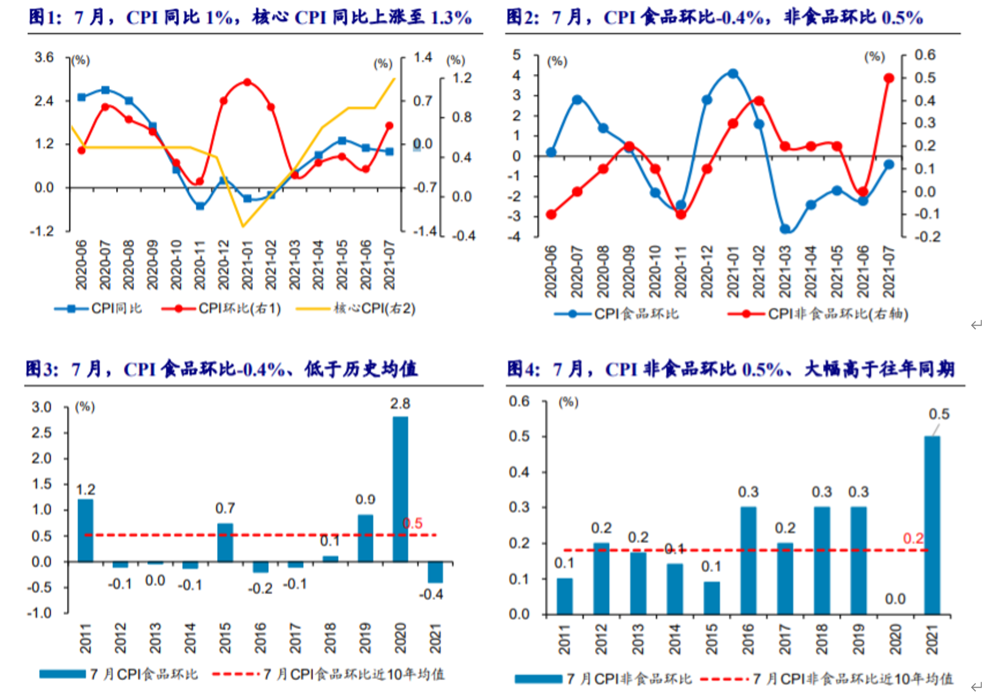

先来看7月的物价，物价略有上升，结构方面依旧是食品在下降，而非食品有所上升，今年的非食品因素比往年都要明显一些，主要还是上游涨价所导致的。

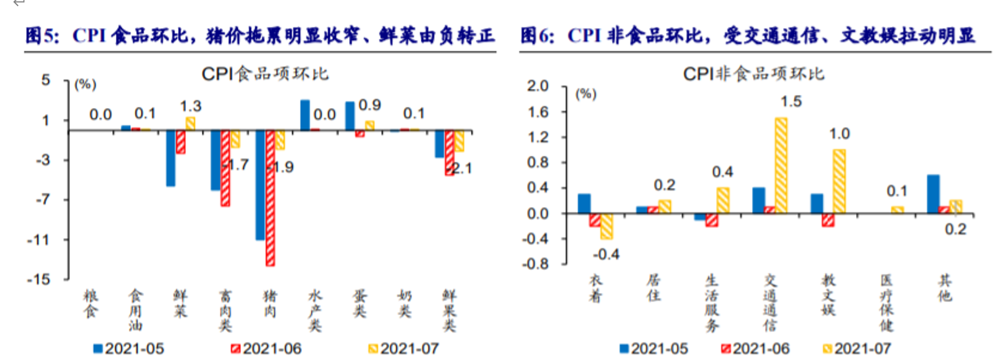

分类来看，交通通信，和教育文娱这块涨幅较多，这个主要是受到季节因素影响，暑假到来，所以在这方面的支出略有增加。但这块可持续性不会很强。其他整个CPI没有通胀的因素。

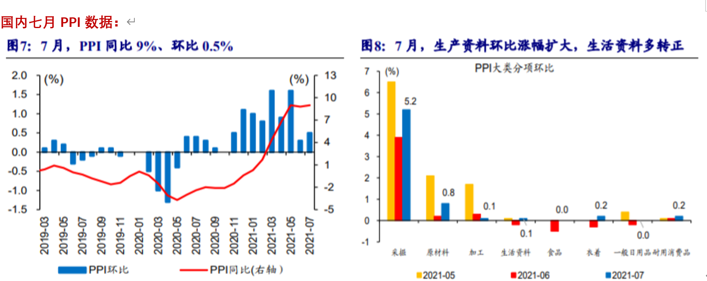

PPI数据维持高位，略有反弹，主要就是金属采掘和原材料这一块成本依旧居高不下，但是PPI环比大涨的日子已经过去了，未来PPI回落已经成为趋势。

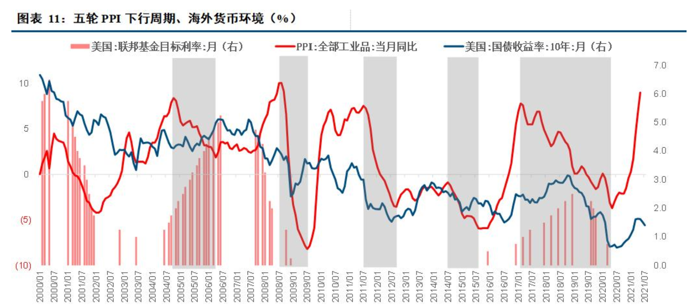

当我们的PPI达到顶点，开始回落之后，美债收益率通常会发生先涨后跌的变化，
但这次可能有点不一样的是，美债收益率，已经很低了，似乎下跌空间已经不大。如果不先涨上来的话，那么可以说是跌无可跌。

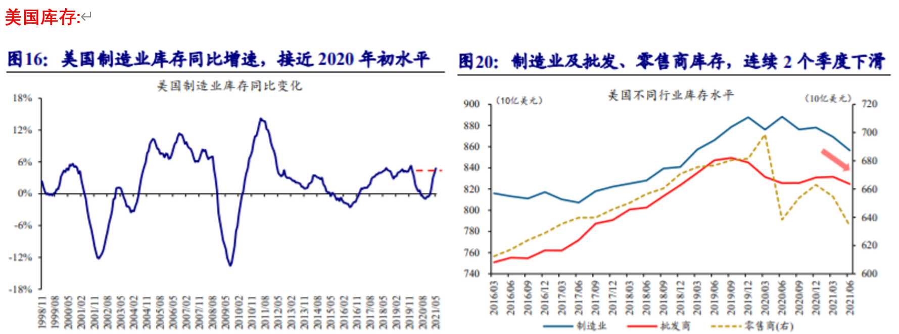

美国的库存数据，现在出现了明显下降的情况，跟我们的库存周期不太一样，我们已经进入了被动补库存周期，也就是东西开始卖不掉了，而美国则刚开始去库存。所以未来他们的经济，还有上行的动力。

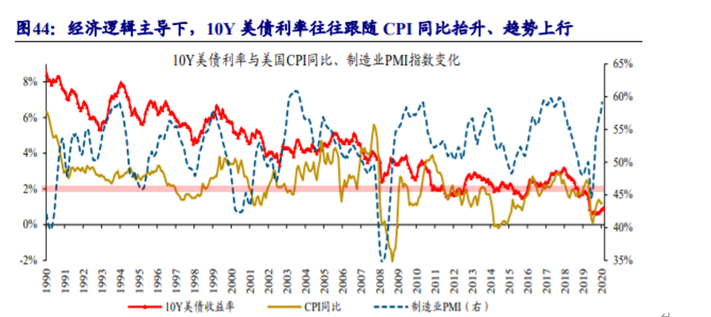

美债和制造业PMI，以及CPI是相关性很高的数据，也就是说，如果制造业转好，CPI上行，那么美债收益率应该上行才对。

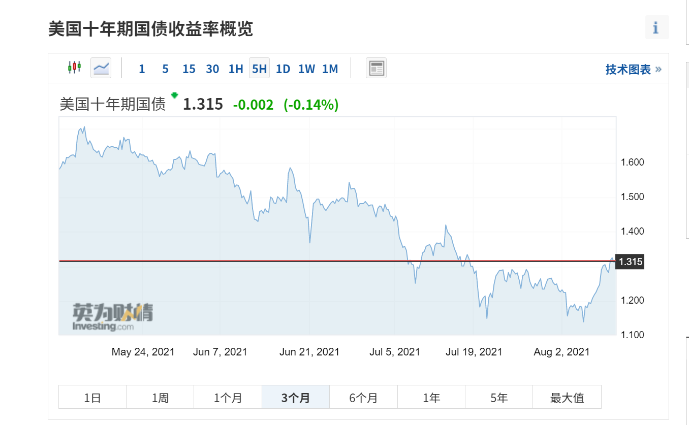

从最近美债的表现看，确实有点上升的意思，但是拉大到3个月的时间范畴还是下行为主。美债收益率十分重要，如果美债开始上行，那么对于中美股市都会形成压力，也会对黄金等商品，形成利空影响。市场风格可能会再次偏向价值。因为当市场利率提高之后，不缺钱的大企业受到的影响较小，而处于成长期的，现金流不是很充裕的中小企业，业绩可能会受到利率成本的影响。所以未来一定要关注美债。

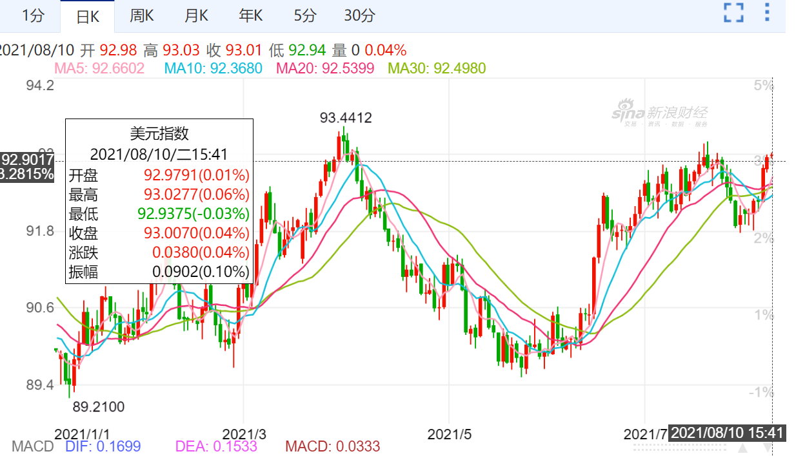

另外，美元指数也已经反弹到了93点以上，美元上升对于大宗商品肯定会有明显的抑制，之前老齐就判断，上半年人民币升值告一段落，下半年该看美元反弹了，未来随着美国经济回升，美元指数也会持续回升

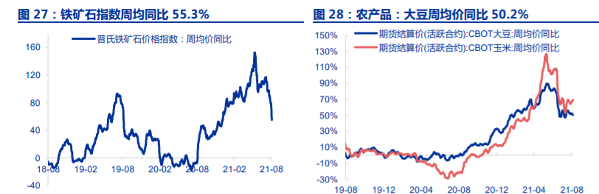

铁矿石和农产品，价格最近也在下跌，而且下降的速度比较快。其实现在有色金属行业内，依然还在上涨的，只有跟新能源相关的小金属，大金属价格其实已经不怎么涨了。老齐还是保持之前的判断，3季度，也就是7、8、9三个月，就会见到比较明显的大宗商品的拐点。

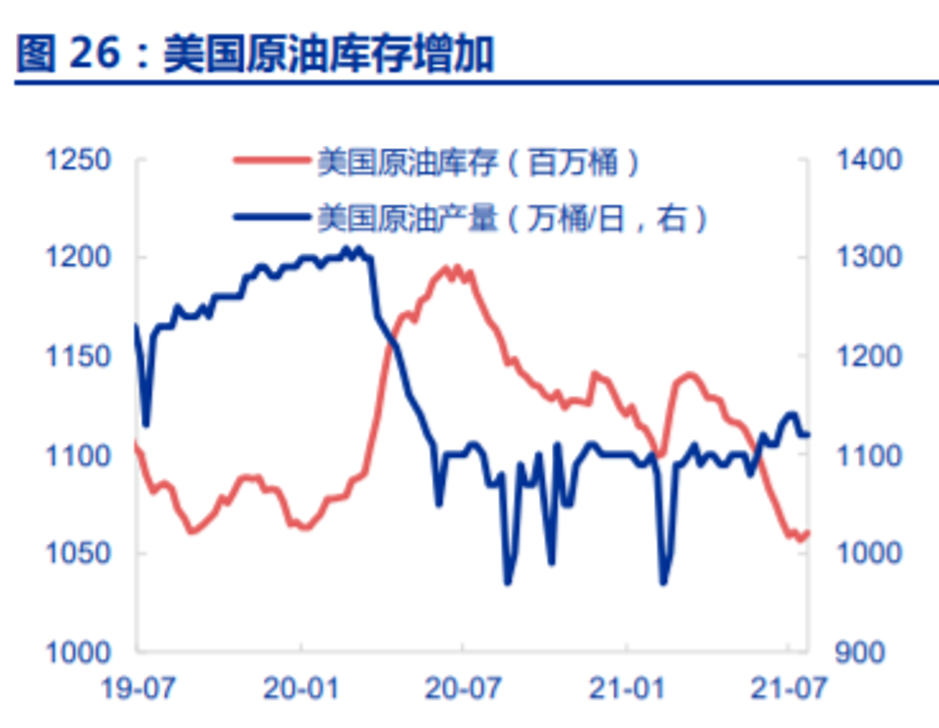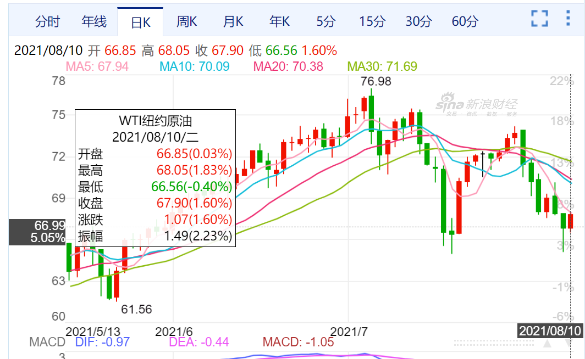

原油这块也有点意思，产量增加，库存下降，但是油价却在下跌，说明什么？说明经济确实起来了，需要原油的地方增加了，但是产量也起来了，大家认为未来供给会大于需求。所以价格也就涨不上去，原油内部已经形成了一种平衡关系，毕竟美国页岩油一旦开动，就会是一种趋势，没那么容易结束。会不断增加供给，直到远远供大于求为止。

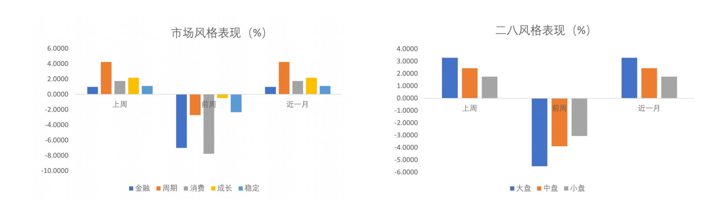

从我们的市场表现来看，目前主要是周期和成长表现最好，特别是大盘周期，金融和消费表现较差。

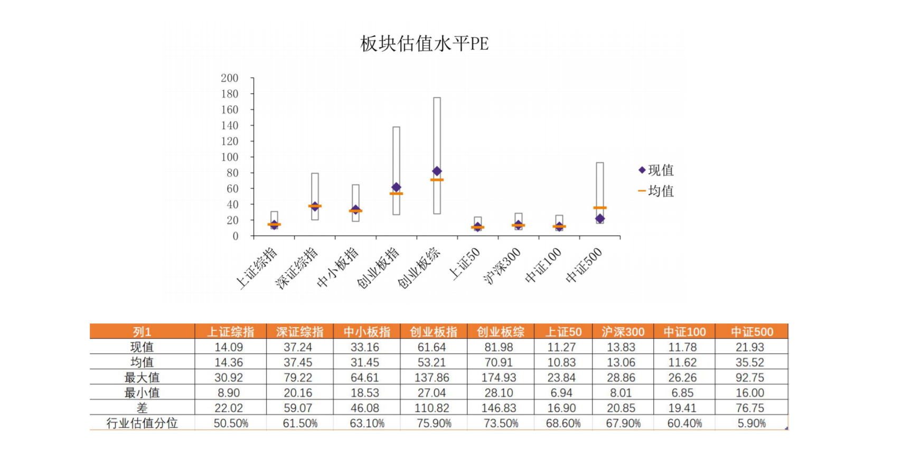

从市场的估值水平来看，目前就创业板略高于均值水平，其他指数，基本都在均值线以内。中证500指数，远低于均值线，但是我们也得说下，由于2015年之后，我们的A股市场发生了很大的内核性的变化是，以前那种炒小，炒差，炒垃圾的玩法一去不复返了，所以500指数的估值也只是提供个参考，未来500指数的估值中枢肯定下移，肯定达不到35倍PE的水平，但25倍应该是问题不是很大的。所以500应该还有空间。现在也确实是低估。

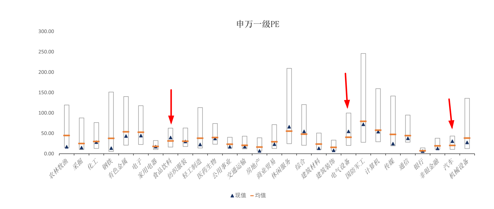

行业划分上，食品饮料，电气设备以及汽车依旧高估，后两个主要就是芯片和新能源。而食品饮料方面，则还没有回调到位。

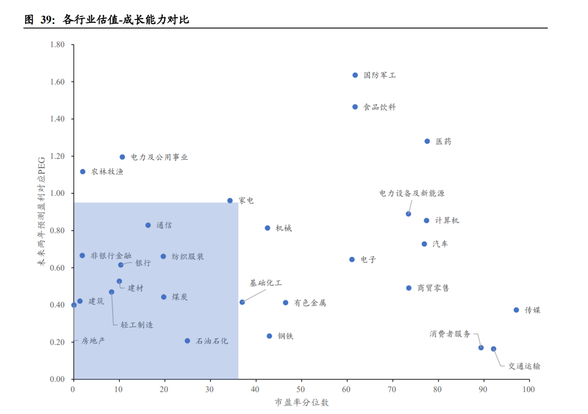

再看这张图，蓝色框框里的行业，基本属于又便宜，成长性又高的行业，扣除掉周期类的行业之外，我们首选银行，非银，还有已经沾边的家电。

**总结：**

**1、通胀无忧，大宗已经接近尾声。**

**2、美债收益率很可能会上行，美元也可能继续反弹，对于大宗都有压制，对市场也不会很有利，特别是对成长风格不利。**

**3、估值来看，成长偏高，周期和成长已经成为热门，未来有望重新回到金融和消费。但现在消费的估值，并没有完全降下来。不要过于着急。**
