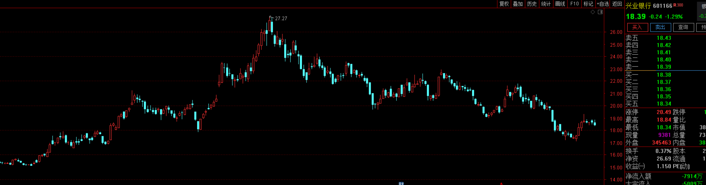

<audio id="audio" controls="" preload="none"> <source id="mp3" src="02/图说投资/【图说投资】机会都是跌出来的！未来市场至少有一个年化10-15的机会【20210817】.mp3"> </audio>

【图说投资】机会都是跌出来的！未来市场至少有一个年化10-15%的机会【20210817】

星球找老齐 稳健高收益

先说下今天的市场，又开始下跌了，这其实都很正常。甚至我们之前一直在强调，沪深300需要重新找到一个波动区间，还有创业板，今天有朋友说他跌跌不休，其实并非如此，就在2周之前，他还创了新高。就是因为短期过热了。所以才要向下调整。

现在市场最大的问题就是结构化的问题，大部分蓝筹股都已经跌下来了，少部分热门板块不可能总在上面飘着，他们一定会掉下来，这也是老齐之前一直在提示风险的地方，主要点名的就是新能源车，周期还有芯片。最近的下跌他们跌的都很猛。

像芯片连续下跌已经超过了15%，蔡公子又要开始变成菜狗了。新能源的跌幅目前还不够，后面也同样都会下跌。这种都属于是过热行业，大家要远离。别忘了基金调仓，永远都是先卖在买，所以调仓的过程，就一定是先跌后涨，热门跌下来之后，冷门再涨上去。最后你发现指数变化不大。但内核结构却发生较大变化。

白酒和医药也没跌完，未来很可能会有一次泥沙俱下的机会，这也是我们这一年，重点等的机会。等到全都跌下来之后，机会也就会重新出现了。

再说今天的数据，最近两年，我们可以看到一个情况，在季报披露之后，公募基金的持仓市盈率都有一个跳升，这说明什么？说明了每次调仓的方向，都是高景气度方向，也就是说向成长方向调仓。越来越忽略价格。如今这种风格，已经是一个历史高位水平。成长风格接近最后的疯狂。

但站在整体市场估值水平来看，仍处于一个20年来的中位数下方，这种估值水平，说明站在10年长周期的格局来看，我们未来仍然有较大的获利空间，起码实现一个年化10%以上的指数收益率应该问题不大。我们不奢望再出现07年或者2015年那样的估值，起码回到中位数，就还有30-50%的涨幅。也就是说，3年之内如果回到中位数，全市场都有10%的年化回报。所以胜算还是很大的。现在不应该悲观，反而他跌下来之后，我们应该略微乐观一些。

我们现在找到了一张，主动管理基金，前30大重仓股的名单，这些公司是被机构们认可度最高的公司，市盈率和相对市盈率双低的一个是中国平安，一个是长春高新，还有就是兴业银行。

基本都是大幅下跌的，但仍然被机构们集中看好。未来如果机构们根据二季报，开始调仓换股，那么很可能变换的方向就是双高，转向双低。那么这些个股代表的方向就是保险，银行和医药。白酒虽然也没少跌，但是跌下来之后，仍然是双高。所以我们宁愿相信家电，也不怎么相信白酒。

从申万一级行业的估值来看，后面这几个轻工，建材，公用事业，传媒，非银，农林牧渔，房地产都应该属于绝对低估了。特别高估的就是新能源产业链。现在军工也不便宜，这些大家要格外小心。

如果在热门里面进行比较，电动车又是热门中的热门，2021年来，电动车上游换手率远高于其他赛道，近一周换手率下降后，仍位于年内换手率水平的相对高位。半导体制造经历了六月的交易热度高峰后，当前换手率回到年内自身水平的相对低位。大家可以看到，只要热度已下降，股价就会出现明显的回落。半导体已经跌了，新能源也正在回归。

从北向资金的角度来说，大家其实反而到应该放心了，资金一直在流入，只有个别周是流出的，说明外资依旧对我们的股市持续看好。一些高ROE的板块已经大幅下跌，正好又给了外资捡便宜货的机会。

**总结一下，**

**1、现在最首要任务就是远离热门，再次强调，新能源，周期，芯片，最近还有军工，这些东西未来很可能会出现腰斩。**

**2、低吸冷门板块，以银行，保险，家电为主，等待白酒，医药，中概互联调整到位。现在机会正在变得越来越多。**

**3、坚守配置，立足于防守。防守反击的前提是守的住，你才有反击的资本，如果不听劝，这波下跌守不住的话，也就没有反击的能力了。所以磨刀不误砍柴工，休息半年，是为了未来更大的收益做准备。**

**4、从长期来看，目前市场问题不大。3-5年的平均市场回报都能有年化10%-15%，也就是说，你只要不追热门，别乱动，抱着指数，这个收益就是你的。企业成长也没有问题，今年大家业绩都开始洗澡了，明年会有重新的增长释放出来。**
