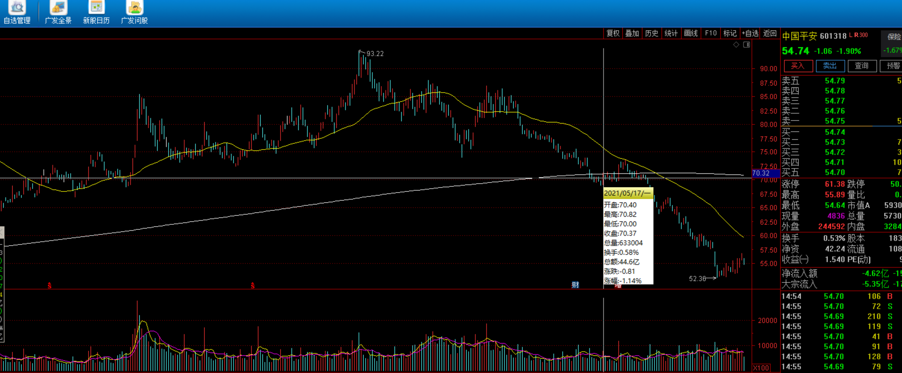
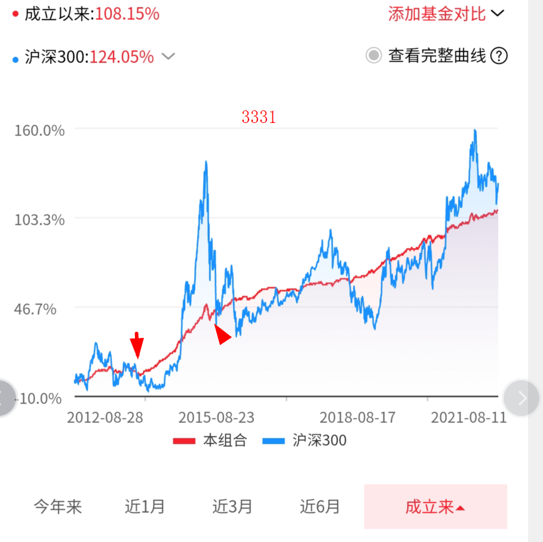
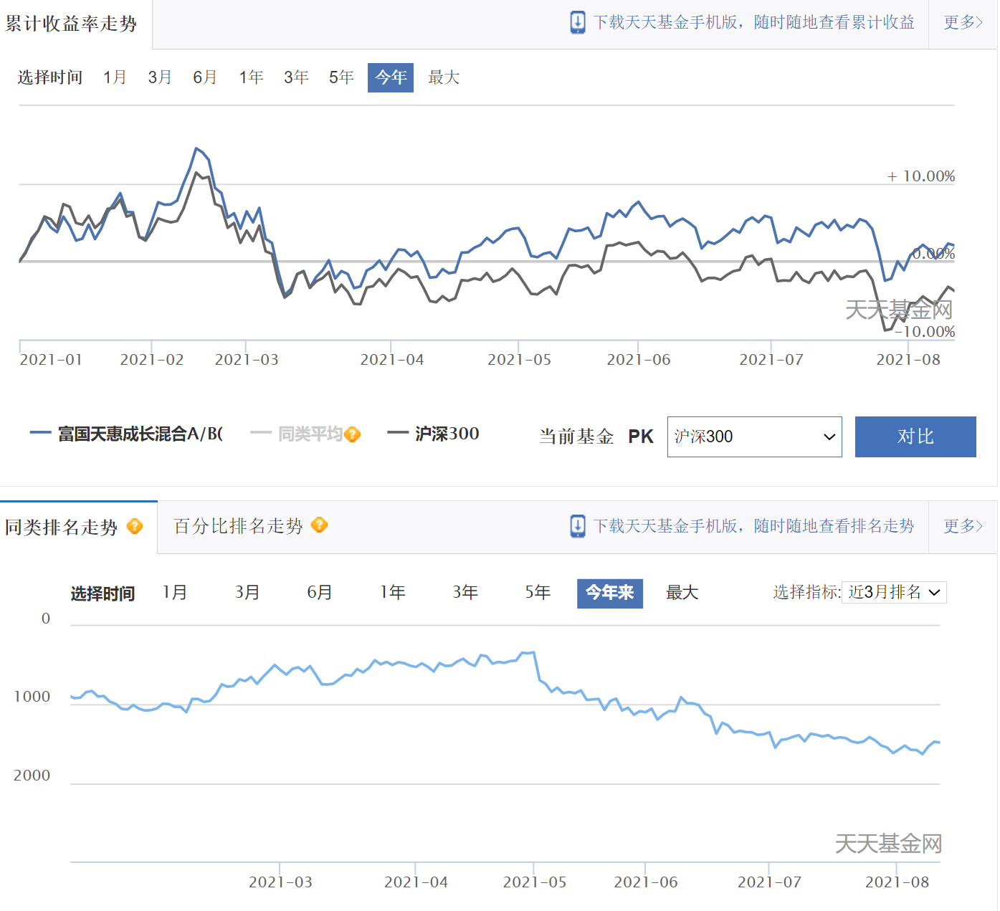
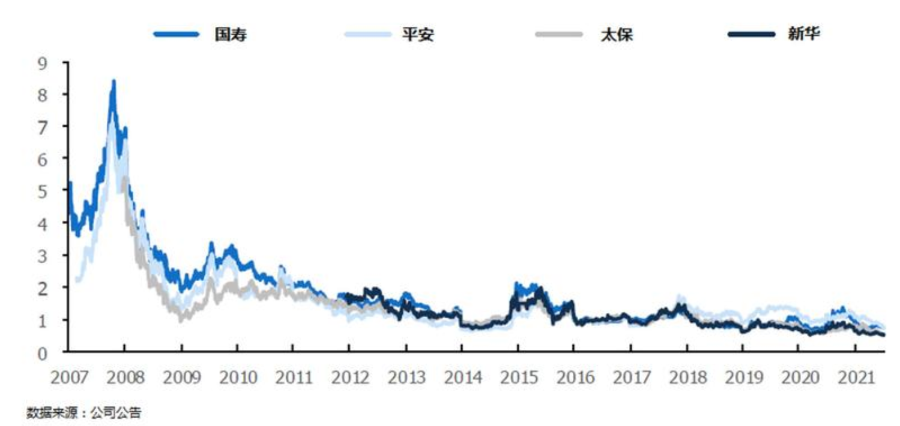
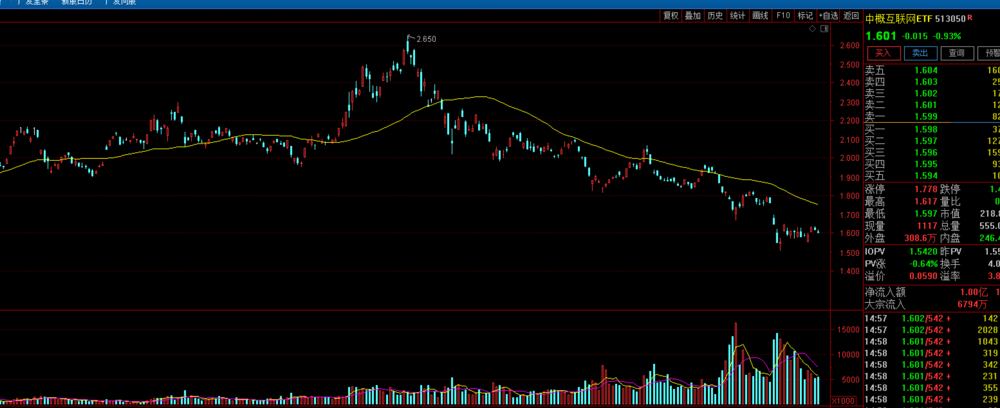
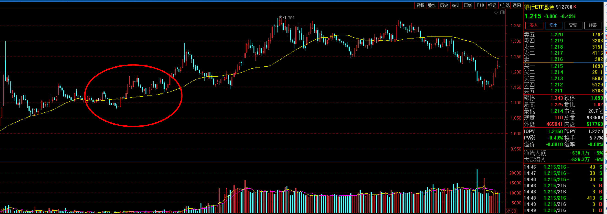
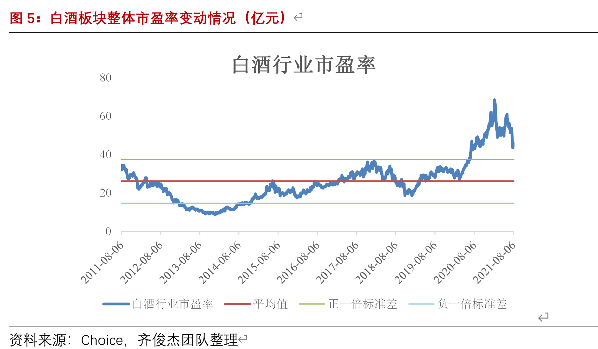
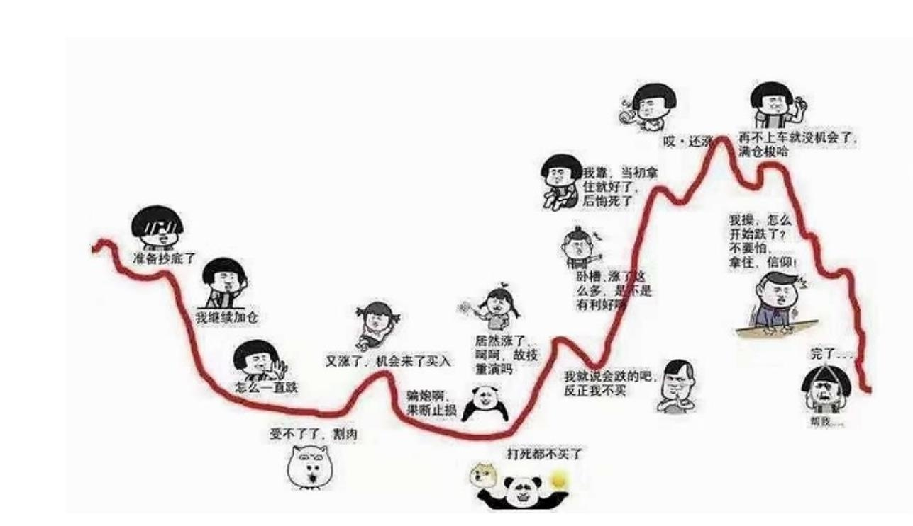

<audio id="audio" controls="" preload="none"> <source id="mp3" src="02/学方法/【学方法】梳理一下抄底的一整套逻辑！【20210812】.mp3"> </audio>

【学方法】梳理一下抄底的一整套逻辑！【20210812】

星球找老齐 稳健高收益

最近很多人都在质问老齐，说你一会让我们三个月买，一会又让10个月定投，还有让24个月的，最近又说了一个48个月，你这到底唱的是哪一出啊，看的我们是一脸懵逼。不知道你到底是什么逻辑，其实这个事他非常的简单。但往往越简单的东西，如果你听过老齐读书，这些其实都应该是相当熟悉的，今天我们就来帮大家捋一捋。

股市上有个段子，说新手死于追高，老手死于抄底，可见抄底的难度是很大的，绝大多数人一位抄到底部了，但其实只抄了个半山腰，为啥会这样，就是因为预期变化，当市场大涨的时候，你就觉得这个东西特别好，总想买没机会，后来一跌下来，你马上就觉得抄底的机会来了。但其实你此时对他的估值和计算，都是在他最好的基本面下做出的，因为通常下跌都是短而急促，基本面坏消息甚至还没有暴露出来。

就拿中国平安举例，之前市场有种说法，珍惜70多的平安吧，确实得珍惜，疑问现在已经50多了。所以这就是抄底抄到了半山腰，然后从
70跌到50，又跌了近30%下去，老手也未必能够扛得住。

正是鉴于这样的思维盲点，所以老齐给大家带来了一整套的抄底模式。在尽可能规避风险的同时，也可以增加抄底的成功率。

首先，什么东西可以一把买入？一定是100%确定的东西，啥东西能有这个确定性，一定是低波动产品，比如国债，债券收益率如果开始从高位回落，纯债价格跌不动了，我们当然可以一把抄底，因为纯债这个东西是不可能赔钱的，我们有100%的把握。那么对应的比如说我们给大家讲过的，广发国开债，易方达中债综合这种产品。该出手时就出手，差一点也没啥关系，纯债这个东西，只要你不是买在了加息周期的起点，基本不会出现什么损失。另外，还有老齐给大家做的组合，比如3331,442，不赔钱这些组合，确定性很高，所以一旦出现下跌，跌个3个点左右。可以大胆的抄底。

其次，可以三个月买的，基本上都是低波动，或者主动管理回撤的那些基金，比如现在的兴全趋势，兴全合宜，富国天惠这些明星基金，甚至广发稳健，南方优选成长，这些基金本身就在主动控制回撤，而且一段时间表现不佳，属于是逆周期时刻。风险已经基本释放了一部分，即便未来继续回撤，空间也已经没那么大了。这种明星基金，连跌半年，其实是极为罕见的情况，我们已经让过了3个月，再买3个月，也就是说拥有了一个极大的抄底概率，虽然不能做到100%吧，但也至少在80%以上。即便遇到了超级大熊市，买完之后再跌10%也就到头了。

除了明星基金之外，我们的组合也要用3个月建仓，由于我们已经通过资产配置把风险释放了一半，再通过择时的选择，避免了最热品种，所以基本上风险也释放了80%，所以除了市场整体过热的阶段，其他任意时候，三个月建仓，基本都有很大的胜算和把握。只要听话的，基本都很难见到回撤，属于那种买来就持续赚钱的。即便是买在了今年1-2-3月份，也应该不怎么赔钱。

第三，10-12个月抄底，这主要就是定投的思路，之所以要这么做，就是预计可能后面还要再跌个一年半载，或者至少是一年半载起不来，当我们认为估值已经绝对低估的时候，就可以使用这种定投方法。

比如保险行业的估值，PEV已经降到了历史最低点，那么未来3-5年内，估值已经没有下跌的空间，估值下行已经被完全封死的话，那么3-5年的收益，就是企业的ROE，有些公司能达到18-20%的水平，整体也有15%，所以这种抄底是把握性很强的，只是因为现在不是他的风格，投资端的因素也对他不利，而且市场情绪普遍偏空，情绪这个东西，不容易把握，有可能会给你打出一个更深的黄金坑来，所以我们才用一年为周期就足够用了。

第四，定投24个月，这是一个最为标准版的定投，一半估值中位数，又是我们看好的趋势性行业，我们就会这么干，主要是怕错过了。比如当时的诺安成长，都在骂蔡经理的时候，我们就觉得芯片这个事，景气周期肯定没问题，暴跌了30%下来，估值也算稍微合理，所以就不愿意再等了，开始24个月定投。现在也有，比如中概互联

现在也还在风暴之中，利空消息不断，但估值已经合理，如果怕错过的话，可以24个月开始定投。但注意，定投也是会随时转变的，当极低估值出现，把整个下跌空间锁死之后，我们也可以转为10个月定投。比如去年底，或者今年初，就有人在定投银行了

当时我们说的是24个月，而现在可以改成10个月。相当于后面的定投就加快了速度。探底成本的速度也更快了。

第五，48个月定投，这是我们说的白酒和医药，因为这属于在半山腰上的估值水平，尽管跌了这么多，但是估值依旧偏高。甚至距离中位数还有一定的差距，坏消息也都没有释放出来，此时老齐是建议在等等
，但如果有些人就是管不住手，非得要去抄底，你还真拦不住，那么就只能在策略上，给予一定的限制，其实48个月的定投策略，是从倒金字塔建仓模型演变而来，也就是说，一开始少买，越往下买的越多。如果未来估值跌到了中位数，我们可以转为24个月，如果跌到了极端水平，可以转为10个月。相当于后面的资金越来越多，可以确保股价跌下来之后，你也能把成本摊下来。

**所以我们简单总结，高估状态抄底用48个月的金字塔，合理估值用24个月标准定投，极低估值下，10个月定投主要是防止短期情绪波动。对于明星基金和老齐给的组合，这些肯定赚钱的东西，只要是逆向机会，3个月均摊基本就问题不大。完全没波动的纯债，才可以一把买入抄底。**

