<audio id="audio" controls="" preload="none"> <source id="mp3" src="02/看行业/【看行业】极端估值出现！传媒到底怎么了？【20210816】.mp3"> </audio>

【看行业】极端估值出现！传媒到底怎么了？【20210816】

星球找老齐 稳健高收益

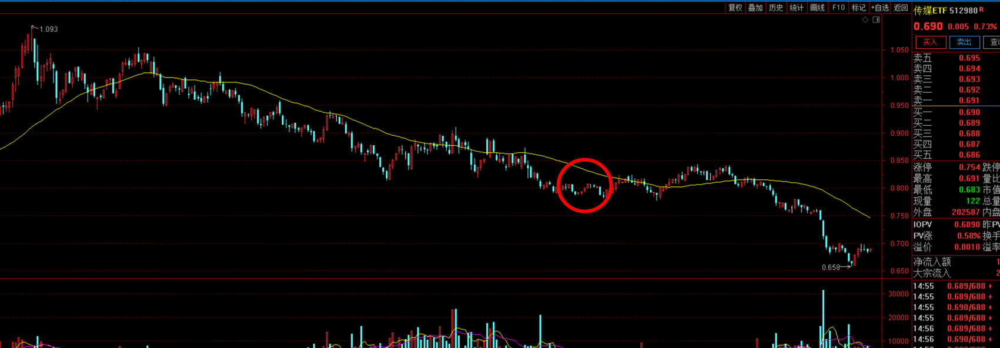

有些朋友正在定投传媒，但是却倍感煎熬，不知道你们是从什么时候开始的，从去年
7月的高点，跌倒现在已经跌去了35%，这个回撤幅度其实还算正常，毕竟很多行业都跌了这么多。

从老齐这边的记录来看，我们去年9月份讲了一次传媒，今年2月1日又讲了一次，最后给大家的几点结论是，1弱势行业，没有热度，2抱团的分众传媒反而最危险，一旦下跌可能会砸出30-40%的空间。基本都已经应验了。

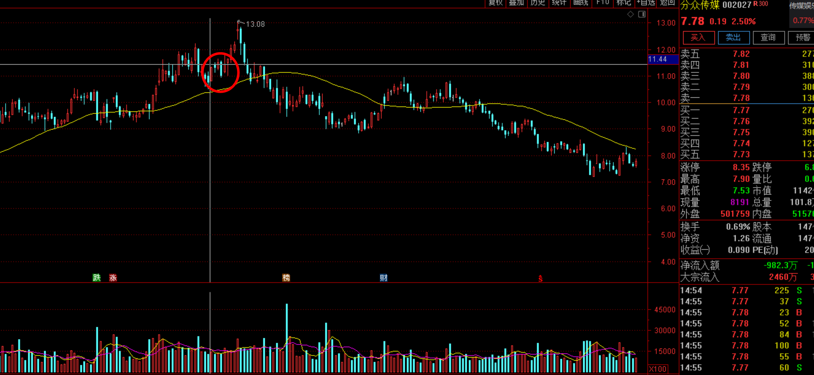

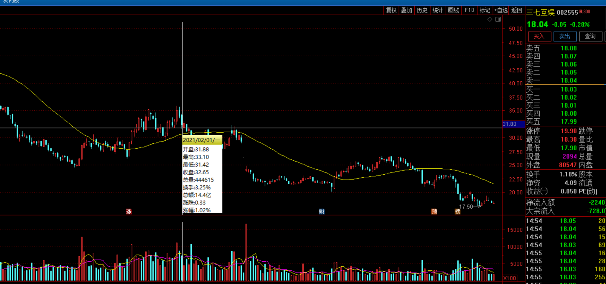

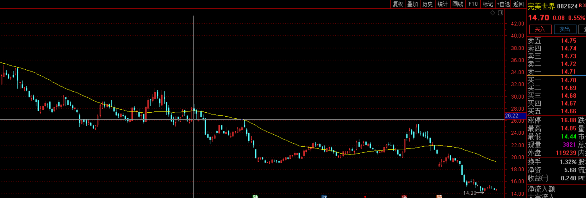

当时在传媒里面我们觉得游戏可能还行，因为当时游戏下跌已经比较多了，但是这个判断是不对的，游戏尽管当时已经下跌很多，但是后面又跌了30-40%下去，并没有比分众传媒跌的少。2月份的时候，我们的总体结论就是胜算不足，唯一看好的理由就是已经跌了5年了，走了大空间的均值回归，那么未来5年也可能会重新涨回来了。所以最后给大家的建议就是，短期没胜算，长期可以考虑。买少点试试手气。

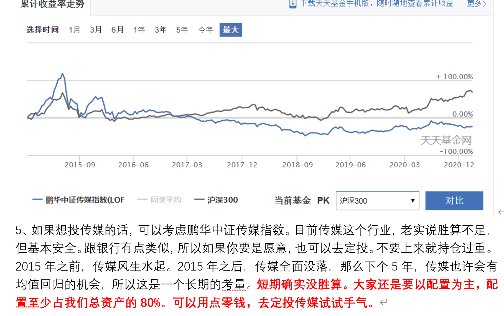

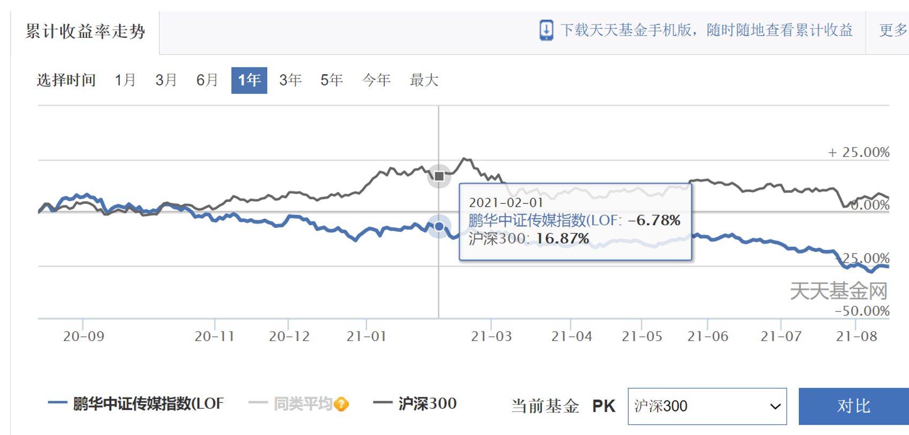

在我们上次讲完了之后，鹏华中证传媒，6个月，又下跌了20%左右。如果你现在定投传媒，在预计的半仓之内，都算合理。保守一点的可能还有17-18个月的资金可投。

那么现在传媒啥情况了呢？基本上广告、互联网媒体、文娱三大业务板块全都在下跌。而且跌幅都差不多40%以上了，本来有望止跌的游戏，由于最近被政策打压，完美世界较去年7月跌去了77%，三七互娱跌去了65%，吉比特因为年初上线的游戏和老游戏表现不错，今年上半年业绩同比增长了63.77%，但其实游戏的限制，都是针对未成年人的，未成年人对游戏公司的业绩贡献其实并不高，单从业绩来说影响不大，但对市场情绪的影响却非常的大。

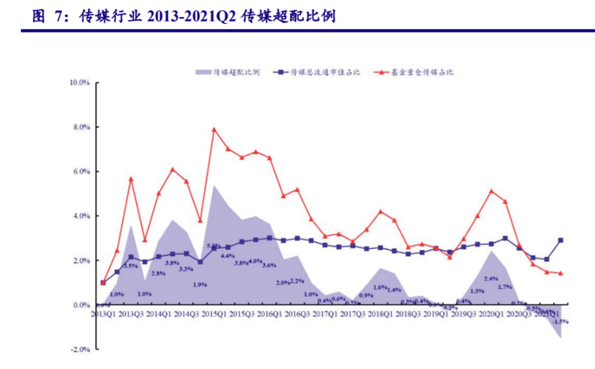

从这张图可以看到，机构们对于传媒行业的悲观预期，现在差不多是历史最低持仓。现在已经不是超配，而是绝对的低配。说明现在该买的也都不买了。情绪已经到了极点。

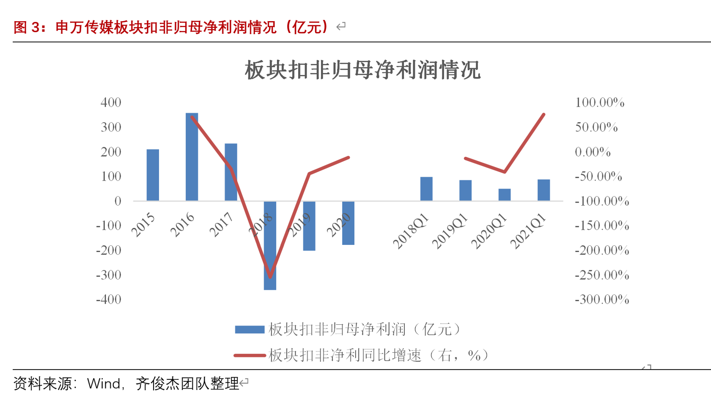

传媒失宠的主因是业绩不好，整体板块近几年扣非净利均是负数，今年一季度业绩刚刚赶上2019年一季度，也就是疫情前水平。不像白酒、科技成长等行业，这些可能会因为短期过热，资金抱团等原因，估值与业绩出现严重偏离，而传媒是典型的业绩导向行业，自15年之后，公司的股价跟业绩基本保持同增同减。今年其实有些龙头业绩不错，分众传媒和芒果超媒增幅都比较明显，扣非净利增速分别为51倍和74.68%。但行业整体的业绩不好，未来一段时间流水预期受限，导致大资金不关注，也拖累了这几家龙头的表现。

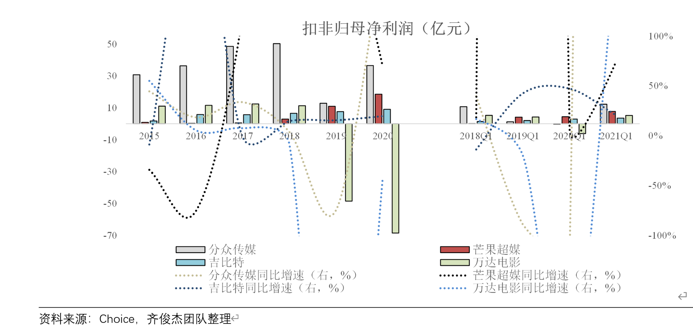

那么为啥业绩表现都不好呢？其实传媒最主要的业绩增长手段是外延式并购，但这几年行业利空不断，监管也收紧了外延式并购的渠道，所以这些传媒公司完全靠内生性增长，其实业绩是很难做出来的。结果就形成了反身性，业绩越差，估值就越低，也就越没办法并购，没办法对外并购，也就就会更差。所以这几年是一路下跌。

可能有人要问了，什么情况才能打破这个死循环？有两个条件，1是某一个事件，或者某一个作品，带动整个行业出现预期转变，比如去年8月，突然院线火爆，带动传媒行业出现一波反转。第2个条件就是股市整体上扬。出现一波全面大行情。这样才会形成整体估值上移，开始正向循环。

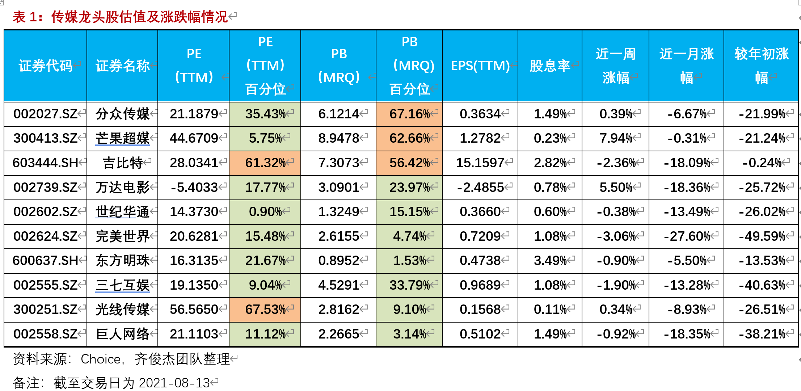

从目前看，传媒行业的业绩，趋势比其他行业都更差，也没有任何的确定性，无论是电影还是娱乐，产生的收入都很难提前预估，从估值分位数来看，大家的参考意义其实也不太大。

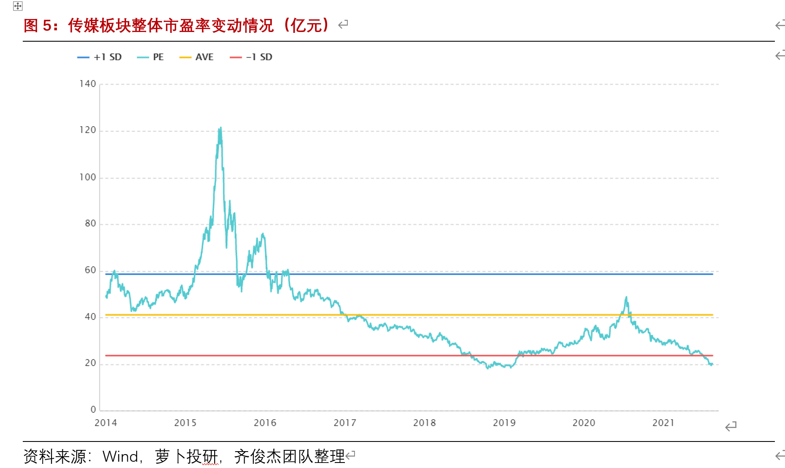

从传媒的市盈率变动来看，现在基本已经回到了2019年初的位置，是一倍标准差之下，应该是历史最低水平了。

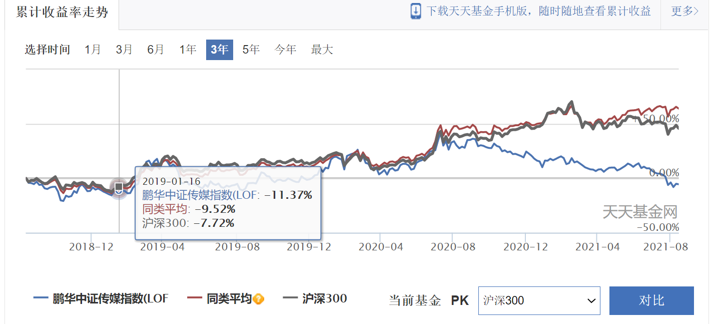

从净值的绝对数来看，也基本差不太多，也就是说，你持有了3年，基本就买了个寂寞。这其实也告诉我们一个道理，长期定投，意义不大。如果当时你是定投的传媒，完全可以在2020年8月之前，有高点止盈的机会，但现在基本又都跌回去了。那么现在能不能投呢？

**我们总结**

**1、确实估值足够低了，甚至是历史最低估值水平。安全性进一步加强。**

**2、业绩反转，目前还看不到，也没有什么确定性。现在依旧反身性向下的阶段。**

**3、我们可以继续定投，现在手里应该有15期以上没有投是比较合理的。如果之前定投过快，可以稍微降一降速度。如果还没开始定投，优先可以定投银行和保险，这是有确定性的行业，但也恰恰因为反身性，未来传媒的弹性可能会更高。但前提是你要能扛得住揍。传媒是一个越投可能越没信心的行业，现在那些基金都已经扛不住撤出去了。更别说个人了。所以一定要慢，宜慢不宜快。**
