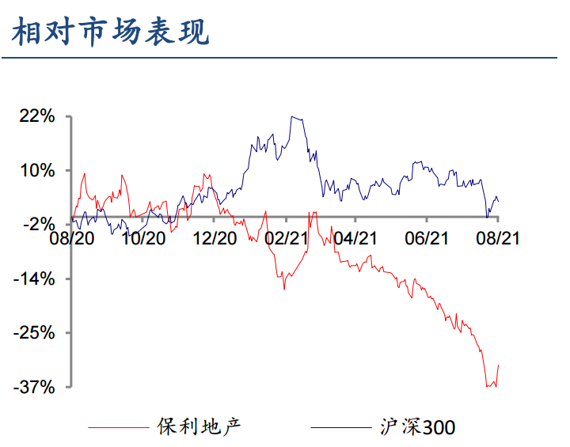

<audio id="audio" controls="" preload="none"> <source id="mp3" src="02/讲基金/【讲基金】地产行业投资的风向标！终于出手了！怎么参与【20210811】.mp3"> </audio>

【讲基金】地产行业投资的风向标！终于出手了！怎么参与【20210811】

星球找老齐 稳健高收益

这几天，大家看到房地产涨势很猛，2周时间反弹已经超过了8%，仔细找原因，基本上是一则消息的影响，央企保利公告，拟在未来6个月内，增持不超过公司总股本2%的股份，并已于公告当日完成首次增持50万股。同时，包括董事长刘平及全体高级管理人员，也将在未来6个月内增持公司的股份，合计增持金额不低于人民币800万元、不超过人民币1500万元，增持价格不超过15.06元/股。

最近房地产板块的大涨，基本上可以肯定，就是保利地产带动的，他已经从最低点9.76元，涨到了现在12.64元，涨幅接近30%，可以说相当可观。

为啥保利涨的这么猛，按说增持50万股，一共也没多少钱，怎么就能这么大幅度的推升股价呢？主要是保利管理层增持的信服力，除了这一次增持，历史上保利还有3次增持，分别是在2008年，2014年和2015年8月。

放在图上大家能看出点啥问题没有，保利地产每次增持，都几乎买在了一个阶段的最低点上。所以不服不行，那么这次保利再次出手，虽然钱不多，但由于之前谜之操作，所以也让市场产生了联想。

虽然保利大涨了几天，但是目前依旧处于一个破净状态，他的每股净资产还有15.89元，这几年虽然在持续的楼市调控，但是保利地产，作为开发商的顶级龙头，其实也几还算不错。目前市盈率只有4倍多，都不用利润增长，只要保利保持这个水平，4年就能把投资收回来。所以这个估值水平，其实已经是没有考虑任何的增长了。有人问了，老齐你不是说地产行业属于周期行业，不看市盈率或者反着看市盈率么，确实如此，站在行业的角度来说，确实不能这么估值，但是站在保利的角度，你看他的利润，其实是持续增长的，也就是说周期行业中的最好的公司，已经打破了周期的束缚。这就是很多基金经理从下到上的逻辑的分析框架。他们相信，任何行业里都有好公司。

但这一年来，保利地产的股价，却并未体现这个好公司的价值，也没有反映他的利润，却严重跑输了市场，跌幅巨大，最多的时候跌去了一半，现在涨回来一点，也跌去了30%。换句话说，现在市场的预期足够悲观，所以给点阳光他也就灿烂了。但问题是，光凭实控人增持，能够彻底扭转市场对于保利的悲观预期吗？或者说，能不能彻底扭转房地产行业的悲观预期？

这个还真不好说。我们看4次保利增持，其实都没有形成一蹴而就的反弹，涨上去之后很快就有掉下来了，2008年在底部真当了7个月才涨上去，2014年也至少震荡了5个月，2015年9月，快速反弹，但是在年底房住不炒之后，又给锤了下来，直到2017年底，才突然暴涨了3个月。现在又是一样，大跌之后增持，但估计很快就会预期冷下来，然后又是漫长的磨底过程。所以没买房地产的也不用着急。一时半会股价飞不了。短期涨上去的，后面可能还得给锤下来。

那么如果要买房地产选什么基金呢？除了上面给你展示的那个，512200房地产etf之外，还有场外的国泰国证房地产指数，160218，重仓了万科和保利

但其实这几年表现极其糟糕，甚至在图上也完全体会不到，保利增持的作用，如果你从2015年一直那到现在，快7年了，你还赔着20%以上，不知道有多少人能经受的起如此大的打击。所以在强调控之下，老齐其实是不太主张做纯房地产基金的，不确定性太大。现在也就头部几个公司便宜了，但整个行业还是个未知数。那么怎么办？我们怎么享受保利地产增持这种提示呢？

我们可以搭个便车，看谁手里的保利比较多，翻看股东一看，前十大重股东里有了一个非常眼熟的名字，兴全趋势！是的没错，这就是被骂成狗的董成非。

他重仓了万科和保利，之前我们很多人都不了解，为啥董成非要重仓地产呢？其实就是因为便宜，他买的不是房地产行业，而是两家极其便宜的好公司。

目前，也随着保利和万科的反弹，兴全趋势最近也出现了明显的好转，3个月时间，对指数进行了反超。

最近董成非回升的速度十分明显，所以如果你想吃一把保利的带来的择时诱惑，可以通过董成非的兴全趋势来完成，未来万科也好保利也罢，估计还有动荡，但是对这两家公司来说，已经相对安全，再加上明星经理董成非替你看着，防止黑天鹅爆发，所以应该足够稳健。**老齐还是那个建议，兴全趋势可以在组合以外，超配20%。3个月建仓即可。之前我就说过，相信老董会王者归来，现在只是开了个头。这些穿越了好几次周期的基金老兵们，稳健的很。买主动基金就是买基金经理的管理能力，而不是他的重仓股，所以下次大家应该长个记性，看到跟自己想法不一致的重仓股的时候，不要过多怀疑，因为你跟他的逻辑恐怕不一致，他看的是公司，而你看的是行业。**
