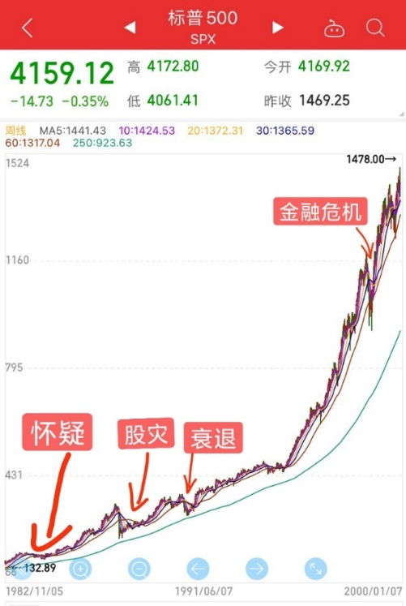
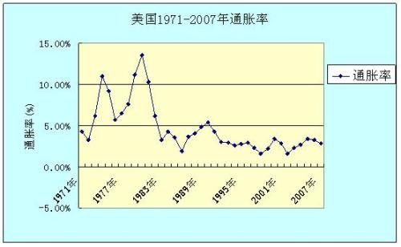
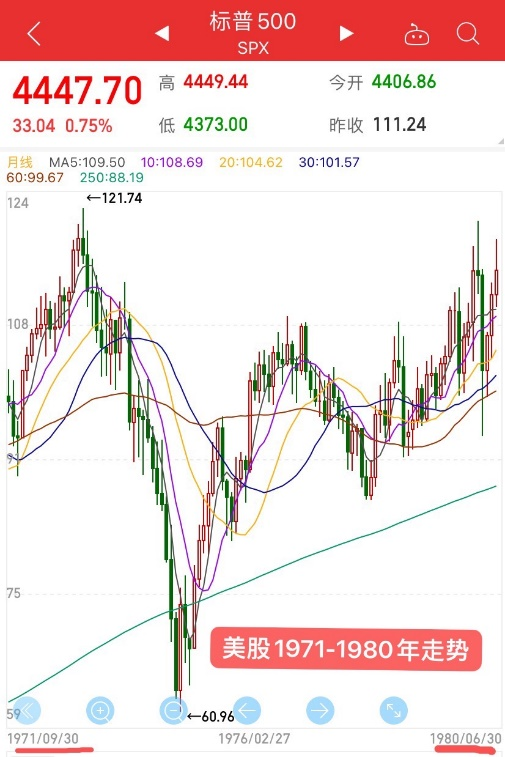
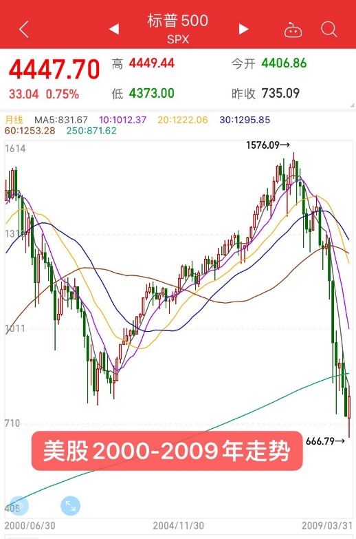

<audio id="audio" controls="" preload="none"> <source id="mp3" src="04/71，大类资产介绍-股票资产.mp3"> </audio>

**71，大类资产介绍-股票资产**

齐俊杰小白集训营 遇见懂理财的自己

各位同学大家好，昨天我们说到了为什么要做资产配置，主要就是因为选股和择时对于绝大多数投资者来说，都是件非常困难的事。甚至机构都未必能做好，就更别说散户了。很多专业的投资机构和投资大师们，其实也都是在用资产配置的方法，把收益分散到各个资产中，通过资产间的对冲和轮动关系，平抑组合波动，享受市场长期上涨带来的收益。而大类资产无非就是股、债、商品黄金和现金资产这么几种。

今天开始我们就来挨个介绍一下这些资产，先来说一说股票资产。

在经济繁荣时期，最好的投资方式肯定是持有股票资产，但是股票资产最大的特点就是波动大，稍有风吹草动，可能就会让你损失惨重。之前第12期内容里，我们就举过一个例子。1982年到2000年是美股历史上最大的一波牛市，但这中间也经历了80年代初的怀疑，87年的股灾，90年代初的衰退，以及98年的危机。即便股市表现很好，但不做资产配置，估计很少有人能持有到底。比如87年股灾，指数一天就暴跌了20%，跌幅30%以上的个股更是比比皆是。

读书圈中齐老师曾给过一组数据，列举了1980年到2000年美国这20年大牛市中，各个资产的收益表现情况。其中股票资产的年化收益将近18%，扣除通胀因素，实际收益也有年化13.3%，20年上涨了12倍。表现次之的是长期国债，年化回报10.7%，扣除通胀是6.4%，20年上涨3.4倍。表现第三的是现金类资产，这里指的不是纯现金，而是货币基金、银行理财、国债逆回购等，年化回报是6.9%，扣除通胀2.8%，20年涨只了70%。表现最差的就是黄金，年化亏损2.3%，再加上通胀因素，实际每年亏损6.1%。所以很显然这20年中，股票收益肯定是最高的，毕竟是20年的大牛市。**但是我们现在分析这些数据，都是后视镜理论，如果当时有这种上帝视角，那其实啥资产也不用买，就全仓一把梭股票，然后长期持有，中间不管怎么大跌大涨，全都不为所动，最后收益肯定最高。但听到这，大家也知道这种方式根本不靠谱，不说别的，就87年股灾那一天，跳楼的就不在少数。所以没人能有上帝视角，也不可能有人能预测出大牛市什么时候开始，又会持续多久。**

比如要是判断错了，赶上美国70年代大通胀的时候，大量买入了股票资产，那么从72年持有到79年，7年的时间，虽然最后名义收益是年化5.1%，看似赚了钱，但扣除通胀，股票资产的实际年化收益反而是-2.8%，相当于1万美元进去，7年后只剩下了8000。大通胀时期债券收益也不会好，7年下来实际收益比股票还惨，是-4%。但是同期黄金的年化收益率却高达24%，可以说美国大通胀的70年代，投资收益基本都是指着黄金来背的。

美股在那波18年的大牛市过后，从2000年互联网泡沫破裂到2009年这将近10年的时间，表现又是非常惨淡。股票资产实际年化收益是-3.4%，这段时间黄金表现依然不错。没有大通胀了，债券资产收益也回正了，年化平均回报达到了5%。

**因此我们可以看到，如果周期错了，重仓股票资产，也会损失不少收益。而且现实中，实际情况往往更惨，即便是在长期大牛市中也有太多人赚不到钱，甚至还会赔掉很多钱。主要就是因为股市波动太吓人，每个人对自己的风险承受能力都是高估的，你以为自己能拿10年，你以为自己能面对30%的下跌，内心毫无波澜。但其实你所谓的信心，全都来自于现在股市正在上涨，当上涨这个基础不存在了，信心也就瓦解了，一旦遇到大风险，全市场都是悲观的消息，说什么的都有，你就以为世界末日要来了，那会估计连神仙都不会相信了，肯定想的就是低位割肉离场，什么长期持有，早就抛在脑后了，因为这就是人性，躲不掉。所以一定要找自己最了解，不考验自己人性的方式去投资，你才能拿得住。资产配置就是这种方式，永远给自己留有后手，投资组合的目的也是为了让你拥有市场，而绝不是要急功近利打败市场，总想当出头鸟，在投资市场中就很容挨揍。**

所以做投资，不要希望每年都成为最好的那一个，我们一定要成为那个长期优秀者，投资是为了在市场中持续的赚到钱，而不是蒙对一次就股神在世，蒙错了就泪流成河，长期跑在前面才最重要。然而很多朋友，可能连基金种类还没分清楚，就张口要年化20%以上的收益，这就属于无知者无畏了。最后结果通常都是不但没赚到钱，反而还遭遇了巨额亏损。**要想战胜市场，一点要先学会敬畏市场，确保自己不输的情况下，再去想赢多赢少的事。**

明天我们继续来介绍债券资产，明天见。
