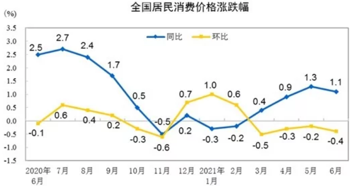
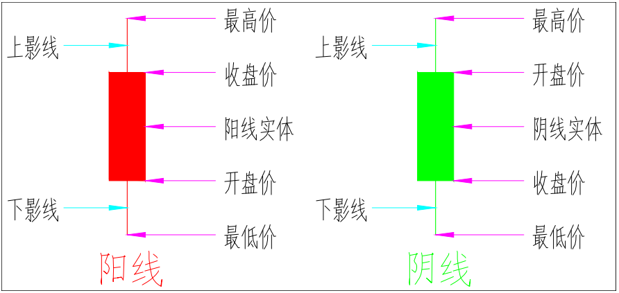
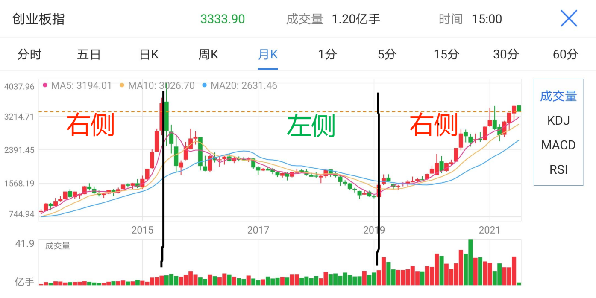

### 一句话名词解释

1、CPI

-   **解释：**消费者物价指数（Consumer Price Index），简称CPI。

-   **构成：**包括200多种各式各样的商品和服务零售价格的平均变化值。

-   **作用：**
    CPI的高低直接影响着国家的宏观经济调控措施的出台与力度，如央行是否调息、是否调整存款准备金率等。

-   **应用：** cpi掉头向下，可视为周期见顶的其中一个标志。
    持续上涨，视为通胀风险
    （3%以下温和通胀，3-8%是中等通胀，超过8%大通胀，超过15%是恶性通胀)
    持续下跌，视为通缩风险。 哪里可以查到：国家统计局官网 近期走势请看下图：

**标注：2021.4月CPI指数0.9%， 同比：跟去年同期相比，环比：跟上个月比。**

2、核心CPI

-   **解释：**与cpi相比，剔除了食品（主要是猪肉、蔬菜）和能源（主要是石油、煤炭)的价格因素。

-   **剔除原因：**剔除一些价格波动较大的产品，才能更清晰的看到物价的变化趋势。

-   **作用：**用来衡量通货膨胀率

-   **走势：**目前持续低位，2021.4月数据是1.3%.CPI的数据是0.9%，数值差距主要因为猪肉价格下跌。
    哪里可以查到：国家统计局官网

3、PPI

-   **解释：**生产价格指数（Producer Price Index，PPI）

-   **作用：**是衡量产品出厂价格变动趋势和程度的指数

-   **PPI与CPI的区别：** PPI可以理解为企业生产成本，CPI可以理解为居民生活成本。

-   **两者间关系：**
    因为企业最终要把成本以更高价格的形式转移给消费者，所以，通常认为PPI的变动可预测CPI的变动。

-   **走势：** 2021.4月PPI超预期达到了6.8 哪里可以查：国家统计局官网

-   **PPI共统计9大类商品：** ①燃料、动力类； ②有色金属类； ③有色金属材料类；

④化工原料类； ⑤木材及纸浆类； ⑥建材类：钢材、木材、水泥； ⑦农副产品类；
⑧纺织原料类。 ⑨工控产品

4、一级市场

-   **解释：**通俗的说是购买未上市公司股份的市场。买了以后等着公司上市变现。当然有极大的可能公司撑不到上市。

-   **发展阶段：**（1）天使轮（VC阶段)也就是买原始股
    这个阶段通常在企业成立初期。 相对便宜，风险巨大。
    一般是阿里腾讯这样的巨头参与的。 （2）AB轮融资（PE阶段) 这个阶段企业发展中期
    （3）pre IPO阶段 这个阶段企业发展的比较成熟，业界也比较知名了。
    风险相对小，价格也相对高 机构，私募参与较多。

-   **散户能不能参与呢？**
    答：我们通常说的打新股，也就是新股申购，就是属于一级市场投资了。（扩展：散户参与一级市场的方式是新股申购，也就是我们常说的打新股。想参与新股申购首先要满足一定的条件，新股申购的条件为申购日T-2日前20天个交易内日均持有证券的市值不得低于10000元，达到条件后，可以直接在证券账户中搜索当日可以申购的新股代码找到新股进行申购）

5、二级市场

-   **解释：**通俗的说，就是交易股票的市场。

-   **二级市场和一级市场的区别：** 录个例子吧：都是卖蔬菜，
    一级市场就像凌晨三四点的批发市场，只有批发商能来，要买就买很多。
    二级市场就像一个自由市场，一个人就能来，你可以买点啥，也可以卖点儿啥。（自由买卖)

6、场内交易

-   **解释：**场内交易指在券商平台交易，场是指证券交易所，可以理解成股票交易大厅。

-   **交易地点：**最早的时候只能去证券交易所交易，现在延伸到开户后，在各大证券交易平台交易。举例，东方财富，中银证券。

-   **交易内容：**股票，债券，四种基金（ETF基金，LOF基金，封闭基金，分级基金）

-   **门槛：**100股起买

-   **价格：**从开盘到结束，价格一直在变化。

7、场外交易

-   **解释：**在证券交易平台以外交易

-   **交易地点：**最早的时候是打电话到证券交易所交易，现在是与银行，基金公司，第三方代销平台交易。比如：支付宝，天天基金

-   **举例：**都是买房。场内就是和房东直接交易。场外就是通过中介公司，中间商赚差价。

-   **交易内容：**基金，债券（场外不能交易股票）

-   **门槛：**10元起

-   **价格：**场外一天只有一个价格（收盘价）； 场内从开盘到结束价格一直在变化。

8、股票

-   **解释：**是股份公司为了筹集资金而发行给各股东的有价证券。

-   **举例：**武大郎的炊饼生意越做越大了，想扩大门面经营了，但是没钱怎么办呢。他找了100张纸按了自己的手印，卖给别人1元一张，说你拿着这张纸，从此以后，我每年赚的钱分你1%
    你要是不想要了，想退给武大郎，那可不行，他表示已经拿着这个钱去租店面了。但是你可以把这张纸卖给别人，价格你俩自己定。这张纸就叫股票。

-   **周边产品：**为了推销这张纸而写成的宣传资料就叫研究报告
    ；鼓吹这张纸多么值钱的人就叫股评家
    ；公司赚了点钱，年底给你发的红包就叫分红（股息）
    ；每年都会出个文件，告诉你今年到底赚没赚钱就叫年报。

9、大盘股和小盘股

-   **解释：**就是市值大小的区别

-   **小盘股：**（举例中证1000） 1，一般100亿以下就是小盘股
    2，多为细分行业，如服装里的造拉链，制造里的造螺丝等小业务，大多难变成大盘股。但是，黑马也往往出现在小盘股里面。
    3，机构较少，分析报告少，管理松散，报表不可信，容易被操控。

-   **大盘股：**（举例沪深300）
    1，地位高，市场占有率高，研报可信，信息透明，不易被操控。
    2，我们A股一般说的，今天大盘涨了，这里的大盘是指上证指数。

10、指数

-   **解释：**反应复杂现象总体数量上的变动。
    我们去体检的时候，血压，血糖这些指标是可以反映一个人是否健康的，这些无数指标的总和，就是你的健康指数。说回股市上的指数，那就可以理解成最近股市是否健康呀？指数涨，就是心肺功能健全，股市跌就是有些头疼脑热。当然，如果其他指标都挺好，但是血脂特别高，也会拉低你的整体健康水平的。

-   **常见指数：**首先介绍下，我们国家有两大证券交易所, 一个是上海证券交易所
    有1500多家公司上市;一个是深圳证券交易所 有2200多家公司上市。

-   **大盘指数：**上证指数 指在上海证券交易所上市的股票的平均走势 上证50
    上证交易所里面最大的50只股票组成的指数；沪深300
    沪深两市中市值最大的300只股票组成的指数 占全网市值60% 大盘股的代表；中证500
    沪深两市中市值排名在300名之后的500只股票组成的指数 中盘股的代表。

-   **还有行业指数：**如医药指数、消费指数、白酒指数等。

11、加息

-   **解释：**央行上调存贷款利率
    加息的“息”指的是“存贷款利率”。也就是说加息了以后，你去存款得到的利息多了，你要找银行借钱，付出的利息也多了。

-   **谁可以做加息这个动作呢：**各国央行（美国叫美联储）

-   **什么时候需要加息？** 经济过热 物价飞涨CPI高起 这时候加息可以给经济降温
    可以理解成 加息是国家不希望你花钱，希望你多存钱。

-   **什么时候需要降息？** 经济遇冷 需求不足 这时候降息可以刺激经济
    可以理解成国家告诉你，别存钱啦，我不想给你利息啦，快去买买买！

-   **与债券关系：**加息导致债券价格下跌，降息导致债券价格上升。

12、市场利率

-   **解释：**这个利率反映的是市场对资金的需求，不受央行控制。
    一般说的市场利率，就是十年期国债收益率。

-   **上涨逻辑：**经济复苏，对钱的需求增加，抢着要了，利率就高了。

-   **下跌逻辑：**经济遇冷，没人借钱了，为了把钱借出去，利率只能降低。

-   **与债券价格的关系：**市场利率上升 债券价格下跌； 市场利率下跌
    债券价格上升；

-   **逻辑：**市场利率上升，那大家都会卖了老债，去买新发的利率更高的债券。卖出多了，债券价格就下来了。反之亦然。

13、基金

-   **解释：**基金就是一揽子股票（你也可以理解成一篮子股票） 而且这个篮子里装的
    可以是股票，可以是债券，还可以是股债混合。

-   **买基金：**就是你把钱交给别人（基金公司)打理，还能赚钱的事儿（当然，也可能赔钱）。

-   **基金公司赚钱逻辑：**
    按持有时间长短，收管理费。所以不管你的钱是赚是赔，基金公司反正是赚到钱了。

-   **基金的分类：**标的有股票基金 债券基金 混合型基金 货币基金

-   **基金经理参与程度：**主动基金 被动基金

-   **募集方式：**公募基金 私募基金

-   **运作方式：**开放基金 封闭基金

-   **按策略：**量化基金 对冲基金

14、ETF基金

-   **解释：**ETF基金是看好某个行业或者某个领域时可以购买的基金。
    交易型开放式指数基金（Exchange Traded Fund，简称ETF）

-   **通俗理解：**比如我除了爱吃肉以外，我还特别爱喝牛奶，到了超市，那么多品牌的牛奶，伊利，蒙牛，光明...都买了吧，太贵了，我也喝不完，就选一个吧，我又怕没选到最好喝的品牌。那怎么样可以让我每种都喝上，又不用花很多钱呢？ETF牛奶，完美的帮我解决了这个问题。ETF牛奶里几乎涵盖了所有的牛奶大品牌，如果我钱不太多，那我出一小份钱，便可以每个品牌都喝上一口。快哉快哉。所以你明白了吗？ETF就是你看好一个行业，或者某个领域的时候，所利用的工具，对于能赚钱的小目标，散弹枪才有更高的命中率。

15、LOF基金

-   **解释：**LOF基金是上市型开放式基金，英文“Listed Open-Ended Fund”

-   **与ETF比较：**（1）投资对象：ETF 一定是指数基金，LOF
    可以是指数和主动型基金，投资范围更广；（2）交易方式：ETF基金只能通过股票账户交易（场内），
    LOF基金可以在场内买，也可以在场外买。

16、FOF基金

-   **解释：**普通基金投资对象是股票，债券。FOF的投资对象是基金。多个基金组成了一个FOF基金。

-   **优势：**1.不用自己判断基金何时买入卖出，FOF基金经理会帮你操作。
    2.基金经理帮你在全市场6800只基金中挑选基金。

-   **劣势：**双重收费，我们需要交一份管理费给FOF基金经理，同时还要交一分管理费给FOF基金经理买入的那些基金。

-   **举例：**
    如果你把钱交给齐老师，让他帮你打理。假设齐老师最终用你的钱买了3322组合。那么，你相当于买了一个“齐俊杰FOF基金”
    你需要交一份管理费给齐老师 还需要交一份3322中四只基金的管理费。

17、封闭基金

-   **解释：**未到期之前无法赎回的基金，和开放式基金相对。

-   **封闭基金和开放基金的区别：**（1）基金总额：封闭基金发行时就规定好了基金总额，
    开放基金总金额随着申购赎回一直在变动；（2）申赎方式：封闭基金到期前不可赎回，但是可以在二级市场卖给别人（只能在场内卖），开放基金可以灵活申购赎回；（3）交易对象不同：封闭基金和封闭基金原持有人交易，开放基金和基金公司交易；（4）费用：封闭基金和股票一样，需要证券交易税和手续费，封闭基金的费用一般高于开放式基金；（5）投资策略：封闭基金因为资金不能赎回，基金公司可100%投入资金，并制定长期投资策略，开放基金要准备应对赎回的资金，相对不能使用长期策略。

-   **封闭基金的优点：**1. 省心持有，反正拿不出来，可避免追涨杀跌。 2.
    基金经理业绩不会受到短期业绩影响，管理更自由。

-   **什么时候适合买封闭基金呢？** 大熊市里，最熊的时候，快熬不住的时候。

-   **在怎样可以买封闭基金呢？** 各大平台搜索封闭基金就好。

18、宽基指数

-   **解释：**宽基指数指是不按照行业划分，用一篮子股票组合反映价格走势的指标。

-   **宽基指数和行业指数比较：**（1）宽基指数：覆盖股票面广，具有代表性的指数
    比如上证指数，沪深300，中证500，创业板指数等；（2）行业指数：只投资于某一行业的指数，比如医药指数、消费指数、白酒指数、银行指数、芯片ETF、新能源ETF等。

-   **优缺点比较：**（1）行业指数：成份股属于同一个行业，会受到相同因素的影响，如行业自身周期性、供需关系变化、相关产业政策等，因此成份股容易表现出相同的趋势，在受到利好因素影响时指数会涨得更强势，但若是遇到不利因素，指数很可能会大幅下跌。行业指数的特征是高风险高收益。（2）宽基指数：相对来说更稳定，牛市赚得少一点，熊市跌得少一些，合适长期持有。

-   **相同优点：**不用选股，便可以获得市场或者行业的平均收益。

19、货币基金

-   **解释：**主要用于投资货币市场上的短期金融品种。比如银行理财，承兑汇票，政府短债，企业短债。

-   **优势：**1.收益比定期存款略高 2.流动性强，可以随时买卖 3.安全性强
    4.购买门槛很低

-   **产品举例:**支付宝的余额宝， 微信的零钱通。

20、主动基金与被动基金

-   **主动基金：**基金经理帮你选股，帮你择时和买卖。

-   **被动基金：**不需要基金经理选择股票，被动的跟踪买入指数里面的股票。也叫指数型基金。

-   **举例：**
    都是超市购物，主动基金经理可以选超市里的任何产品，被动基金经理只能选大礼包，里面的产品和比例都是固定的。

-   **基金名称举例：**（1）主动基金：xx精选，xx成长，xx优选，这类一般都是主动基金。
    （2）被动基金：xxETF链接，xx中证白酒指数。

-   **被动型基金还分为两种：**（1）宽基指数：比如沪深300，中证500。（2）行业指数：比如芯片ETF,新能源ETF。

21、ETF联接基金

-   **解释：**复刻ETF指数的场外基金 （投资于ETF基金的基金）

-   **问题：**之前有很多的小伙伴不理解，为什么我说ETF只能在场内交易。好多小伙伴告诉我，我在支付宝里就能买ETF基金。是的，但是支付宝里的ETF，后面还有两个字“联接”。

-   **ETF基金和ETF联接基金比较：**（1）交易平台不一样：ETF基金可在二级市场（股票证券账户）买卖，ETF联接基金是通过第三方[基金销售](http://fund.eastmoney.com/trade/default.html)平台交易，比如天天基金、支付宝蚂蚁财富等；（2）投资标的不一样：ETF投资标的是指数成分股，ETF联接基金直接投资ETF基金；（3）[费率](https://jin.baidu.com/article/3593835.html)：ETF联接基金大于ETF，场外ETF联接在各大平台大约
    千分之1.5，场内ETF基金大约 万分之5；最后的差距大约1000元相差1元手续费。

-   **关于误差：**那有人问了，都复刻了，怎么有时候走势不一样啊？就是全买一样的，也有买入时间差距，甚至有些也不是百分百的复刻指数的，这个就叫做指数的跟踪误差。

22、存款准备金

-   **解释：**银行存放在中央银行的钱

-   **目的：**为了客户可以随时提取资金，不至于所有的钱都被银行拿去做投资了。比如银行一共有100W的存款，银行为了盈利要把钱放贷出去，但是全部都放出去了，客户来提现就没钱了，所以要上缴央行一部分保存起来。

-   **存款准备金率：**就是要交给央行的钱，占银行收上来的总存款的比例，不同规模的银行比例不一样。比如：大型银行：11%；
    中型银行：9%； 小型银行：6%；
    央行存款准备金率提高，说明有意图收缩市场流动性，告诉银行，少往外借钱啦，多交点儿上来。降低银行准备金率，就是我们平常所说的降准，也就是释放市场流动性。

23、外汇准备金率

-   **解释：**外汇进来后要上交央行的比例

-   **近期情况：**2021.5.31日，央行上调了外汇准备金率，由5%上调到7%，上次上调还在2007年；外汇准备金率提高，有可能抑制人民币的升值。因为，更多的外汇被上缴到了央行，流通中的外汇减少；
    外汇升值，人民币贬值。

24、前端收费与后端收费

-   **解释：**指的是申购赎回费。
    前端收费指买入时收费；后端收费指买的时候不收费，卖出时收费。

-   **举例比较：**（1）前端收费：吃肯德基，就是前端收费，付完钱再取餐；（2）后端收费：一般饭店吃饭，吃完喊小妹结账，就是后端消费。

-   **扩展：**一个基金，两种付费模式，对应会有两个基金代码，以大家关心的兴全趋势为例，163402是前端收费，163403是后端收费

-   **怎么选呢？**打算长期持有的话，就选前端；短期持有，就选后端。

-   **具体收多少钱呢？**购买之前，查看买卖规则，每个基金都不太一样。
    以兴全趋势为例，10w拿3年，费率只相差150元，所以小伙伴们在购买的时候不用过多纠结前后端的选择问题。

25、杠杆

-   **解释：**加杠杆就是借钱，去杠杆就是还钱

-   **举例：**比如你首付30万，通过跟银行贷款的方式，借钱买了100w的房子，你就是给自己加了杠杆。借钱用来扩充资产就是加杠杆，还钱减少负债就是去杠杆，大到买房贷款，小到刷信用卡买个包子都是加杠杆。

26、期货

-   **解释：**就是定一个价格和期限，交易未来的东西。

-   **举例：**两年前的今天，猪肉十块钱一斤，我给了猪肉店老张100块钱，我们约好，两年后，我可以去拿十斤猪肉。今天我去了猪肉店，发现猪肉30块一斤了，我转手一卖，赚了200元。这里的两年，就是期货的期，这里的猪肉，就是期货的货。为了怕老张两年后不认账，跟他签订的合约，叫做期货合约。

-   **生活中最常见的期货：**比如你买了还没盖好的房子，就叫期房。

-   **期货分类：**（1）商品期货：比如棉花、大豆、石油、黄金、白银等；（2）金融期货：如股票、债券等。

27、做多（多头）

-   **解释：**看好并买入某一资产，希望他后面会涨价（资产涨了赚钱）

-   **举例：**最近连续下了一个月的雨，雨伞都脱销了。本来10块钱一把的伞，涨到了100块一把。这时候出现了一个人，申鸿飞。他觉得，以后每天都会下雨，雨伞会涨到1000块钱一把，这就叫看多，于是他以100元的价格买了100把伞，想着等1000块的时候卖出去，这就叫做多。而申鸿飞此人就叫做市场里的多头。

-   **在基金股票上运用：**其实我们平常买基金买股票，都是做多，我们希望这个资产后面会涨价，我们就是多头。

28、做空（空头）

-   **解释：**借来资产先卖掉，约定好时间再买回来还给对方（资产跌了赚钱）

-   **举例：**还是上次下雨的例子，雨伞已经从10块涨到了100块了。这时又来了一个人，蓝师兄。他觉得，一直下雨是不可能的，这辈子都不可能的。天一定会放晴的，雨伞价格也一定会跌的，这就叫看空。于是蓝100元的价格借来了100把伞，约定好1个月之后买了一样的伞还回去。这就叫做空。蓝，就是雨伞市场的空头。
    那么接下来，就会发生一件很有趣的事了，申鸿飞拿着100把伞，等着伞涨价赚钱。蓝借来100把伞卖了，等着伞跌价，他好买了还回去。不管雨伞是涨是跌，他们两个一定有一个赚钱，有一个赔钱。
    所以多头和空头在市场里是完全对立的。

-   **提示：**最后告诉大家，永远不要做空，做空是一个收益有限，风险无限的事。真的跌了，你最多赚1倍，但是一直涨，你的亏损就会没有上限。
    你学会了嘛？

29、阳线与阴线

-   **解释：**阳线代表当天盘中上涨 阴线代表当天盘中下跌

-   **识图：**带大家认识一下K线柱状图，如下图：

-   **图中内容：**首先，柱状图分两个颜色，红色和绿色。
    红色代表当天上涨，也叫阳线。柱状图的底边代表开盘价，顶边代表收盘价。
    绿色代表当天下跌，也叫阴线。底边代表收盘价，顶边代表开盘价。
    也有个笑话说，三根阳线改三观，意思就是不管多差的行情，连着大涨三天，你就会觉得市场又有希望了。

30、上影线与下影线

-   **解释：**K线柱顶边上面如果有条细细的竖线，就叫上影线；
    K线柱底边下面如果有条细细的竖线，就叫下影线。
    

-   **扩展：**（1）上影线:顶边上面如果有条细细的竖线，就叫上影线，最上面的点，是盘中最高价，表示盘中涨上去了，收盘又掉下来了。阳线上影线的长度为盘中最高价与收盘价之间的差距，阴线上影线的长度为盘中最高价与开盘价之间的差距;(2)下影线：底边下面如果有条细细的竖线，就叫下影线，最下面的点，是盘中最低价，表示盘中跌下去过，收盘又涨了回来。阴线下影线的长度为盘中最低价与收盘价之间的差距，阳线下影线的长度为盘中最低价与开盘价之间的差距，影线越长，代表当天波动越大。

31、市盈率PE

-   **解释：**表示按照当前的赚钱速度，多少年可以收回成本。

-   **作用：**是用来判断股价贵不贵的重要指标

-   **计算方式（有两种）：**（1）当前价格/每股收益（净利润除以总股数）；（2）当前市值/当年总盈利

-   **举例：**股价30元，每股收益0.3元， 30/0.3=100
    就是这个股票，保持当前盈利能力的前提下，需要100年回本。

-   **扩展：**一般来说，股价走低，市盈率降低，表示低估。但是也有特例，比如周期行业，往往是价格越跌，反而市盈率越高。因为他们的利润下跌速度往往超过了股价跌速。
    比如，某周期股票本来100元股价每股盈利10元。股价跌到80的时候，每股盈利可能已经跌倒5元了。所以股价在下跌，反而市盈率涨了起来。比较市盈率的时候，一般在同行业内比较，比如，茅台和五粮液比，他们都是白酒。可别把茅台和宁德时代比哦。

32、静态市盈率

-   **解释：**就是以去年的赚钱速度，一家公司多少年可以回本。

-   **举例：**申鸿飞花了100W，投资了一个快餐店。2020年1月开始营业的，一年半之后，他突然想起来，这么投下去，啥时候能回本啊？
    他找来了会计，问：几年可以回本啊。会计说，哟，我手上没有今年的数据。我拿去年的数据给您算一下吧。去年一年赚了15W，按这个速度。6年半能回本了。所以啊静态市盈率就是市值除以去年的盈利。表示的是，按照去年的赚钱速度，多久可以回本。申鸿飞表示太久了，不能接受。于是他又去找了店长。那么店长跟他说了啥呢？请听明天的动态市盈率。

33、动态市盈率

-   **解释：**就是预估一下今年能赚多少钱，然后按这个赚钱速度，多少年可以回本。

-   **举例：**还是那个申鸿飞开快餐店的例子，他觉得会计给的6年半太长了，于是他又找来了店长，让他重新算算，到底多久能回本。店长说，老板，你别急。今年已经过半了，目前为止我们已经赚了12万了，按这个速度，今年可以赚24万。按照这个速度呀，4年多一点就可以回本了。
    所以啊，动态市盈率就是市值除以预估的今年总利润。如果说静态市盈率的缺点是数据相对滞后，那么动态市盈率的缺点就是，没那么精准。
    在听到了2个版本之后，申鸿飞同志迷惑了。同一个店，怎么两个人估算的差距这么大呢，于是他找来了第三个人，店里每天烧菜的厨子。那么厨子会跟他说啥呢？请听明天的滚动市盈率。

34、滚动市盈率（TTM）

-   **解释：**就是按照刚刚过去的12个月赚的钱来算，多少年可以回本。

-   **举例：**依然是那个开了快餐店的申鸿飞，他今天找来了每天做菜的厨子。问问他觉得几年能回本。厨子说了，我不是会计，我不知道去年赚多少，我也不是老板，我算不出今年将要赚多少。但是我天天在炒菜，我知道刚过去的12个月炒了多少菜，我觉得您还是脚踏实地，按这个数据来算多少年回本吧。所以啊，滚动市盈率就是以刚过去的12个月赚钱的速度，来算多少年可以回本。
    最后，复杂计算了一番。厨子说，我觉得5年可以回本。
    那么最后申鸿飞听了谁的呢？那就要问他自己啦！
    关于市盈率就说到这里了，全剧终。

35、市净率PB

-   **解释：**市净率(Price-to-Book Ratio，简称P/B
    )指的是每股股价与每股净资产的比率**每股股价/每股净资产,**这也是巴菲特特别喜欢的指标。

-   **两种算法：（1）**市值/净资产 **（2）**每股股价/每股净资产

-   **净资产：**所谓净资产，就是这个公司的资产总额减去负债，也就是这个公司到底值多少钱。

-   **扩展：**如果一家公司市净率是3，也就是你用了三倍的价格买下了这堆资产。你希望，这对资产以后可以涨到五倍，十倍。
    一般情况下，一只股票市净率越小，说明越低估，投资价值大。当然也有特殊情况，比如银行的市净率常年都很低，那是因为银行业绩稳定，利润增长的想象空间很小。

36、市销率PS

-   **解释：**用销售额来给一个公司估值的方法

-   **算法：** 市值/销售额 每股价格/每股销售额

-   **举例：**比如武大郎开了一间炊饼店，估值呢顶多也就10万。不巧遇到了疫情。账面上看起来一年销售额有10万，殊不知，房租人工水电成本加起来要最后还亏了5万。老老实实的武大郎打算告诉大家，今年的市盈率是10万除以-5等于-2.这事儿被他媳妇知道了，大骂他笨蛋，这个数据扔到资本市场上，肯定股民都疯狂出逃了呀。这里啊要用市销率。10万市值除以10万销售额等于1.妥妥的变成了一家有潜力的公司。
    **所以啊，市销率就是用销售额来给一个公司算估值。**

-   **什么样的公司适合用市销率估值呢？**
    没有盈利的高科技公司，比如那些还在烧钱抢占市场的公司。他们还在资本扩张期，利润都是负数，所以没有市盈率可言。那就用销售额给他们估值。一些创业者，都喜欢拿这个指标来吹牛。
    比如没有产生利润之前的京东，美团，都是用市销率来估值的。
    某种情况下，销售额其实比盈利更真实。盈利更容易造假，比如控制成本，或者控制支出费用。

37、M0, M1, M2

-   **解释：（1）M0：**也叫基础货币，就是我们平常流通中的现金，流动性最高。
    **（2）M1：**也叫狭义货币，M1=现金+活期存款（这里的活期存款等于马上准备花的钱，代表了现实的购买力）
    **（3）M2：**也叫广义货币，M2=现金+活期存款+定期存款（M2流动性稍差，代表了潜在的购买力）

-   **扩展：（1）M1增速快：**说明大家消费欲望强烈，经济活跃。
    **（2）M2增速过快：**说明长期投资和存款比较活跃。
    **（3）M1-M2剪刀差：**能够直接反映对未来经济的预期，可以作为判断信用和经济的先行指标。剪刀差扩大，M1增速大于M2时，说明消费需求旺盛，有物价上涨预期，存款活期化，活钱增多，此时股市容易有机会。
    剪刀差缩小，M2增速大于M1时，说明大家存得多，花的少。存款定期化，死钱增多，大家愿意把钱存银行。

-   **哪里可以查到M1
    M2数据呢？**各大财经网站，比如：[乐咕乐股网\_在这里学会股票投资](https://www.legulegu.com/)

38、公募基金和私募基金

-   **解释：**公募基金就是通过公开发售来募集资金的，私募基金就是通过非公开发售来募集资金

-   **举例：**买公募基金就好比你买货架上的公仔，喜欢哪个款式就选哪个。私募基金就好比你买公仔盲盒，买的时候不知道里面装的是什么。

-   **两者对比：（1）募集对象不同：**公募基金向广大社会公众募集，没有人数限制，也没有投资门槛。
    私募基金对象是少数的合格投资者，拥有300W金融资产或者50W年收入证明。私募基金产品的投资门槛在100W以上。
    **（2）产品规模不同：** 公募基金小到几个亿，大到百亿千亿，规模是比较大的
    私募基金相对较小，几千万也有，操作相对灵活。 **(3)信息披露不同：**
    公募基金对投资标的，投资组合，产品净值等都要求严格披露
    私募基金对这些就没有明确要求，只对投资者进行适当的净值披露。
    **(4)赚钱方式不同：**公募基金赚取管理费，旱涝保收。
    私募基金靠“业绩提成”，与投资者共进退，投资者吃上饭了，管理人才能喝粥。

39、QDII基金

-   **解释：**指投资境外市场的基金 英文：Qualified domestic institutional
    investor

-   **扩展：**（1）QD基金是经过国家批准的，在国内从事包括香港、美国、德国、日本等境外证券投资的基金。
    （2）投资QD基金就是你把人民币交给基金公司，基金公司把你的人民币换算成外币，然后再去投资海外市场。
    简单来说，就是你通过QDII基金间接的参与到了海外各类市场的投资了。

-   **有人问了，为什么我不自己直接投资海外市场呢？**
    首先，QD在不占用你的外汇额度的情况下就帮你做了全球资产的配置。
    其次，也省去了你去开美股、港股账户的麻烦流程，想要购买海外资产，你既要开通海外资金账户，还要开通海外的证券账户，相当麻烦。通过QD基金你可以间接买到美国的好公司，以及像阿里巴巴、腾讯等国内互联网巨头的股票。

40、量化基金

-   **解释：**通过计算机制定策略并买入卖出的基金

-   **举例：**比如计算机经过海量历史数据测算，发现出太阳的日子就是比下雨的日子上涨多，那么量化规则就此创立
    只要晴天就买入,雨天就卖出，这就是一个简单的量化交易策略。
    通过计算机从过去海量的交易中删选出来大概率可以有超额收益的机会，制定相关策略，让计算机执行买卖操作。

-   **为什么要使用量化交易呢？**
    用计算机公式模型来代替人为的主观判断，可以避免人性中的贪婪和恐惧，使投资决策更加客观。

-   **扩展：**据说基金公司的量化策略有3000W条之多，有些时候之间并没有任何逻辑，比如出太阳就上涨，毫无逻辑，但是可能就是会有超额收益，这个不用等人脑想明白，电脑就会主动去做了。
    量化基金与有主动基金刚好对立，主动基金依靠基金经理的人为选股，择时来操作，量化基金则不依靠人脑而靠电脑来操作。

41、对冲基金

-   **解释：**买入相反策略的资产，从而对冲风险的基金。

-   **举例：**今天大师兄申鸿飞的女朋友来家里吃饭。申鸿飞准备买100块钱的菜，女朋友喜欢吃虾，但是100元都买虾吧，怕老妈不高兴，说自己有了媳妇忘了娘，于是申鸿飞拿50元买了虾，花50买了老妈喜欢吃的猪蹄。这样就是风险对冲了，没有全部买女朋友爱吃的，用猪蹄对冲了万一老妈生气的风险。所以这个100块花出去以后，基本就没有挨骂的风险了。
    举个投资上的例子就是，同时购买雪糕厂和滑雪场的股票，那么不管天冷还是天热，你都可以赚钱了。
    所以你明白了嘛，对冲基金就是同时进行两笔方向相反，数量相当，盈亏相抵的交易，用一定的成本去对冲掉风险，来获取低风险利润。

42、阿尔法收益

-   **解释：**超过平均水平的超额收益

-   **举例：**一般滴滴司机一天的平均收入是600元，但是司机申鸿飞同志因为车技高超，外加对周边环境的熟悉，和平日里老顾客的积累，他平均一天能赚800元，那这个多于市场平均水平的200块钱，就是申鸿飞这个司机所赚到的阿尔法收益。
    明白了嘛？阿尔法收益，就是这个产品的赚钱能力和市场平均水平的差距。阿尔法系数越高，说明这个产品的赚钱能力越强。

43、贝塔收益

-   **解释：**市场平均收益

-   **举例：**周末，晴空万里，大师兄申鸿飞和一群小伙伴们去小河里泛舟，所有人都不想费力气划船，想着顺着水流飘到终点就行。只有申鸿飞同志努力的划拉了几下，最终比别人早了5分钟到终点。这里，申鸿飞的朋友们取得的就是贝塔收益，而申鸿飞本人经过努力早到了5分钟，这个就是阿尔法收益。
    所以你明白了嘛。贝塔收益就是市场平均收益，而阿尔法收益就是超越平均水平的额外收益。

44、基金后面的ABC

-   **解释：**表示的是这个基金的收费方式

-   **扩展：**经常可以看到，名字完全相同的基金后面跟着不同的字母，A或者C。他们是同一只基金，只是收费方式不一样。
    A大部分表示前端收费，在你买基金的时候收取费用。B大部分表示后端收费（现在用的很少了，一般都是A和C）
    在你卖基金的时候收取费用。C不收申赎费，申购和赎回的时候都不收费，但是要按照持有时间长短，收取销售服务费。

-   **那我们到底如何选择呢？**（1）长期持有：
    选择A，申购的时候一次性付了申购费，如果持有的时间长了就没有赎回费了。
    （2）中短期投资：
    选择C，没有申购赎回费，但是按照你持有的时间收费，持有一天收取一天的费用。持有时间越长，收费越多。
    有一点需要注意的，不管是买A还是C，持有不满7天赎回，都有一个1.5%的惩罚性的费用。

45、环比和同比

-   **解释：**（1）同比是和去年同期比，比如，现在是2021年6月24日，今天的同比就是2020年6月24日；（2）环比是和上个月同期比，比如，现在是2021年6月24日，今天的环比就是2021年5月24日。所以，环比就是满月，同比就是周岁\~\~\~

46、通货膨胀

-   **解释：**流通中的货币变多了 钱更不值钱了

-   **举例：**小时候的2B铅笔2毛一只，现在2块。为什么呢，因为现在全社会的货币总量比我们小时候多了很多，但是需要的货物并没有多很多。每件货物的价格就上去了。通货的意思就是流通中的货币，膨胀就是变多嘛。所以通货膨胀就是流动中的货币变多，导致物价上涨。

-   **扩展：**每个国家定义通胀的标准都不太一样，在中国3%以下是温和通胀；3-8%是中型通胀；大于8%是大通胀；
    大于15%是恶性通胀。一般国家都会超发货币制造适当的通胀，
    为了提高货币数量和货币流通速度刺激经济，但是恶性通胀就是导致人心惶惶。

47、通货紧缩

-   **解释：**流通中的货币变少了 手上的钱更值钱了

-   **扩展：**流通中的货币减少，物价下跌，货币升值。看起来，同样的钱，我们可以买更多的东西了，好像是件好事，但其实对居民来说，大家都知道物价要跌，就会选择延迟消费，或者不消费。对企业来说，大家都不消费了，生产出来的产品就会过剩，价格还要下跌，这就会严重损害实体经济的利益。就会出现经济萧条。对于国家来说，通缩是比通胀更可怕的事儿。

48、借壳上市

-   **解释：**优质的未上市公司买入已上市公司的股票 并发布自己的产品

-   **举例：**申鸿飞不是开了一个餐饮店嘛，主要就是卖烤串儿的。生意做的贼好，他很想上市，迅速扩大规模。但是呢这个上市流程太复杂了，动不动就要让他等上个两三年的，这他哪等得了，这么好的生意，这不耽误他融资的黄金时间了嘛。一合计，他找到了隔壁已经上市的“老王火锅店”，这老王，虽然上市了，生意差得要命，股价也贼低。于是申鸿飞就找他谈，大量的买进老王的股票，拿到了公司的控股权。然后申鸿飞就在火锅店的壳下面，搞了一个新产品，火锅串串。最后就等于，申鸿飞借了火锅店的壳，让自己的串串成功上市了，最后连这家火锅店的名字都被改成了“老申火锅店”。
    所以你明白了嘛，借壳上市就是买下了别的公司的股票，发行自己的产品。最快几个月就可以完成了。现在也有些人买空壳公司的股票，就是在赌，这个壳会不会被借走。别人借你的壳就要大量买你的股票，那么股价就会上涨了。

49、套牢

-   **解释：**股票交易时所遇到的交易风险

-   **举例：**申鸿飞回老家，发现所有人都在山上抓野猪。他一打听，原来是前几天来了一伙猎人，说2000元一只向村民回收野猪。还真有几个胆大的，抓了野猪过去交货，真拿回来2000，这下全村沸腾了，都抄家伙上山打野猪去了。
    申鸿飞一听，也赶紧加入了捕猪大军。没过多久野猪就被抓的差不多了，于是猎人烙下一句话，我先把这批野猪运回去卖了，我的客户很稳定，常年要猪，你们继续抓，再抓到的，我出4000一只收。
    就在申鸿飞发愁的时候，遇到了一个卖野猪的，说手上有一批野猪出售，卖3000一只。他一想，3000入，4000出，还不用费力气抓猪，可以啊。交了3W拿了10头猪。再给猎人打电话的时候，你们懂的，再也打不通了。10只猪只能养在家里做宠物了。
    所以你明白了嘛？买入资产等着增值，却发现卖不出去了，这个就叫做套牢。
    又过了几天，来了一个开野货餐饮店的，说，哥们儿，我的客人也常年要猪。我出500一只，全要了...最后，申鸿飞含泪卖出了10只野猪。这个就叫做割肉！

50、MLF

-   **解释：**中期借贷便利，也就是央行借钱给商业银行

-   **举例：**申鸿飞开了一家快餐店，打算找银行借点钱来扩大规模。但是银行不太愿意贷款给小企业，咋办呢？
    恰好央行计划放水，又怕钱流入房地产推高房价，所以把钱拨给符合要求的商业银行。有的时候，央行会规定，这个钱要流向小微企业或者三农等薄弱环节，这个时候，申老板的春天就来了，就更容易借到钱了。

-   **所以你明白了嘛，**MLF是一种央行投放货币的工具。央行通过招标的方式向符合条件的商业银行提供一般3个月到1年的特殊贷款。并要求银行向指定对象发放这些贷款，比如小微企业。商业银行拿国债，央行票据等抵押向央行贷款。

-   **借款期限：**3个月、6个月或者1年，属于中短期贷款。

51、LPR

-   **解释：**贷款市场报价利率（Loan Prime Rate, LPR）,可以理解成浮动利率。

-   LPR就是每月20号,银行们在决定利率的时候，先看看上面的领导啥意思（也就是MLF）再在领导的基础上加点儿往外贷款。那么加多少呢？由18家银行共同决定，去掉一个最高值和一个最低值，再取平均值，最后确定出的具体数字，就是LPR.

-   **为什么会有这个浮动利率呢？**比如无肉不欢向申鸿飞借了10W元。说好借1年，再给3个点的利息，双方都能接受。但是如果我说要30年才还给鸿飞，问他收我几个点的利息？可能他也答不上来了，因为时间太久了，不可控因素太多了。于是就出现了这个浮动利率，到时候大家都跟着这个市场的利率走，谁也不吃亏。

-   **扩展：**LPR分为1年期和5年期，1年期和企业融资有关5年期和房贷有关（LPR+加减点）那有人说，我当时拿房贷的时候可是有折扣的呀。LPR了之后还有折扣嘛？答案是LPR没有折扣，但是有加减点。举个例子：2019年初申鸿飞在北京买了一套房，当时的房贷利率定为5.5%，转了LPR之后，参考2019年12月发布的5年期以上LPR利率为4.8%，那么鸿飞在转换为LPR后的加点值就是LPR+0.7
    直到所有房贷还完。而运气比较好的无肉不欢买房的时候房贷利率是4.5%。在转为LPR之后，房贷利率就变成了：LPR-0.3
    直到所有房贷还完。

52、左侧和右侧

-   **解释：**左侧就是基金或者股票的走势一浪低过一浪，右侧就是基金或者股票的走势一浪高过一浪。
    

-   **大家看我截图的创业板，**并不是左侧就代表一直下跌，中间也是会有起伏的，所以我们说的是一浪低过一浪。
    同理，右侧也不是一直上涨，是一浪高过一浪。
    我们说的左侧右侧要看长期的K线图，比如月K线。短期的日K无法代表趋势，所以没有太大的参考价值。
    左右侧是为了看过去一段时间到现在的大概趋势，是用来判断当下应该使用什么样策略，
    而不是精准预测未来行情，大家切记这一点。

53、融资

-   **解释：**最简单的理解就是借钱

-   **扩展：**融资分为直接融资和间接融资。

-   **二者区别举例：（1）接间融资：**申鸿飞的快餐店要扩大规模，他找到了银行贷款100W，其实鸿飞借到的钱可能是无肉不欢昨天存进去的100W。但是肉肉可能就拿到了3%了利息，鸿飞则要付出6%的利息来借这个100W。这就是间接融资。**（2）直接融资**：鸿飞通过银行这个中介，借到了普通百姓的钱。
    对企业来说，因为有中间商赚差价，所以需要付出比较高的利息。而且并不是所有企业都能从银行那里贷到款，就像法国人说的，银行通常更愿意借钱给有房有车的富人。对投资者来说，钱比较安全，但是收益也比较低。
    但如果鸿飞说，我不找银行借钱，我上市，发行股票，让看好我快餐店发展的人都把钱投给我，赚了钱我给他们分红，股价跌了我也不负责赔偿。这就是直接融资。

-   **利弊：**普通百姓直接把钱给企业，可能会赚很多钱，但问题是，也可会亏钱。所以直接融资可能收益很高，也可能损失本金，盈亏自负。
    对企业来说，不用向间接融资一样给那么高的利息了，直接一毛钱利息都不用给。对投资者来说，想把钱投给谁就可以投给谁了。风险自己担着。

-   **哪些形式可以融资呢？** 1.向银行贷款借钱 1.向个人，企业借钱
    2.发行股票和债券借钱（也就是股权融资和债权融资）

54、债权融资

-   **解释：**企业通过发行债券来对外借钱

-   **举例：**还是申鸿飞的快餐店，想要扩大经营，他算了一下，需要100W。但是他只有80万，还差20W，于是他找来了蓝师兄借钱，说我给你写个条，20W借1年，利息5%，1年后，连本带利我还给你21W。蓝想了想，合适啊，于是从床底下翻出了私房钱...

-   **所以你明白了吗？**债权融资就是通过发行债券来借钱，到期之后还本付息。但是也需要公司保持良好的现金流，这个故事里面，一年后鸿飞如果拿不出21W，还不了钱，那就算是债券暴雷了，他的信用会降低，以后再要借钱啊，那就难了。

55、股权融资

-   **解释：**公司通过发行股票来达到筹集资金的目的

-   **举例：**还是申鸿飞借钱的例子，昨天本来打算向蓝师兄借钱的，但是鸿飞回家想了想，觉得不行，借20万借一年要给1W，有点亏啊。有没有什么办法，可以不用给利息呢，最好啊，连这个20W都不要还了。第二天，他找来了逸师兄，说，师兄啊，我这个快餐店，真的有前途，是我们老申家几十年的独家秘方火锅底料，你看看门口那个排队的人啊，要是扩大规模了铁赚。现在哥们儿差20W，你给我这个20W，以后这个店赚的十分之一的钱就是你的了。我可是去年一年就能赚80W的。
    逸想了想，正好手里有比钱没什么用，就投给他吧。

-   **所以你明白了吗？**股权融资就是通过发行股票出让自己的股权，从而获得资金。对鸿飞来说，别说利息了，本金都不用还了。而对逸来说，如果这是一家不错的店，那他就可以稳稳的获得分红，如果鸿飞的快餐店有一天上市了，他的20万，说不定就能值200W或者2000W了。当然，如果鸿飞亏损了，也可能他的20W就有去无回了。

-   **两者比较：**从利息上看，股权融资是指公司卖出股权，让对方成为股东，不需要还债，也没有利息，债权融资需要还本付息。

-   **使用期限比较：**股权是可以一直持有的，融来的资金可以一直使用，没有期限，债权融资规定了借多久，就只能用多久。

-   **投资者风险比较：**股权融资可能能赚很多钱，但也可能亏损，投资者盈亏自负。债权融资到期后还本付息，风险相对较小，但是一旦暴雷，企业还不上钱，也是有血本无归的风险的。

-   **公司的控制来看：**股权融资会稀释股东的股权，最终会影响公司的控制权
    债权融资不会影响到股东的权益，不会涉及到公司的控制权

56、除权

-   **解释：**把单价高的股票，1股拆成若干股，从而降低股票单价。这个行为叫做除权。

-   **举例：**当年的天价切糕大家还记得嘛！一刀下去10000多一斤。土豪见了也是含泪喊贵。为了让更多的人吃的起，卖切糕的大爷把一斤切糕切成100份，那100块就能买一份了，就有更多的人买得起了，他的生意也会更红火了。
    所以这种不影响总量，把蛋糕切成小份出售的骚操作，就叫做除权。
    为了方便识别是除权的股票，都会在股票名字后面加一个XD。

57、大宗商品

-   **解释：**在流通领域关于工业或者农业的原材料之类的

-   **在投资领域，大宗商品主要分为四大类：**1、工业金属（如铜，铝，锌等）；2、贵金属（黄金，白银）；
    3、农产品（小麦，玉米等）；4、能源品（煤炭，石油）。

-   **走势：**大宗商品走势往往跟经济周期密切相关，经济开始过热，通胀开始上升的时候，大宗商品通常会有很好表现。所以大宗商品的投资是不能长期持有的，否则只会来回的坐过山车。

-   **价格：**大宗商品以美元计价，美元贬值，有利于大宗商品价格向上，但他们之间负相关性没那么强，大宗商品最终价格，还是要取决于需求，如果经济周期结束，对于大宗商品的压制力会大于美元贬值的助推力，大宗商品用美元计价，所以他们是负相关。

58、债券

-   **解释：**就是一张可以买卖的借条

-   **举例：**申鸿飞的快餐店要扩大了，他想借100W资金，于是他发行了1W张面值100元的债券，发行时间是2年。为此，他愿意付出5%的利息。刚好无肉不欢有10W闲钱，想稳稳的获得利息。于是肉肉买了10W的鸿飞债券。如果一直不卖，拿满两年，可以获得5%的利息。但如果中途，肉肉发现了更好的投资品种，蓝师兄债券，利息7%
    那她可能会卖出鸿飞的债券，去买入收益更高的别的品种的资产。
    所以债券是一张借条，拿满期限可以得到承诺的利息，如果不想要了可以卖给别人，所以他是可以张可以买卖的借条。但是，一旦2年后，鸿飞还不上钱了，那就是暴雷了，肉肉的钱就有可能血本无归了。

-   **按发行主体分：**可分为利率债和信用债（明天说）

-   **按照持有期限：**短债，中债和长债

-   **按照利率分：**固定利率债，浮动利率债，甚至0利率债

59、利率债

-   **解释：**信用等级比较高的部分发行的债券，比如国债

-   **扩展：**主要是指财政部发行的国债、地方政府债券、三大政策性银行（国家开发银行，中国进出口银行，中国农业发展银行）发行的政策性银行债和央行票据。

-   **发行背景：**利率债的发行背景都比较牛，基本上都有国家或者政府级别单位信用做背景，因此风险很低，给人的感觉就俩字：靠谱！
    利率债信用较高，收益相对低。

60、信用债

-   **解释：**是企业靠自身信用发起的债券，到期还本付息。

-   **举例：**我们经常听到的“刷脸”。申鸿飞去楼下熟悉的小卖部买带盐，发现没带钱，于是告诉人家，我先拿走了，回头把钱补上。或者他急用1W元，找蓝师兄借，说第二天还。那是什么让鸿飞可以顺利的拿到盐和1W元？说白了，是他这个人在对方心里有这样的信用存在。
    所以信用债就是公司用自己的信用做担保，发行债券从而向大众借钱，并承诺还本付息。

-   **信用债种类：**信用债主要包括企业债、公司债、其他还有短期融资券、中期票据、次级债等品种，大家了解一下就好。

-   **风险：**至于信用债的风险大不大，不能一概而论，关键看这家公司的经营状况了，到时候如果还不起钱，就是这家公司的债券暴雷了，信用破产了。
    我们怎么区分信用债是不是安全，会不会暴雷呢？
    有信用评级机构会帮我们给企业做信用评级。一般最高是AAA级，能拿到3A等级，说明这家公司的经营状况良好，盈利能力比较强，同时信用极好，债券违约的风险比较低。（但评级只能作为参考，也会有特例，）
    另外，通常公司给的利率越高，可能就代表风险越大，一个公司但凡给5%的利息可以借到钱，他是不会给10%的利息的，所以高出来的利率就是风险补偿，大家都觉得借钱给我风险大，那我只能多给点利息，从而让你更愿意借钱给我。
    如果担心某只债券暴雷，就不敢投资债券了，大可不必，我们可以通过债券基金来投资债券。

61、可转债

-   **解释：**可以转换成公司股票的债券

-   **投资可转债的人有两种选择：** 1.持有到还本付息（通常利息极低）
    2.在约定的时间内，把债券转换成股票（没有利息，但可享受股利和股票增值）

-   **扩展：**熊市中，可转债下有保底，牛市来了又可以转成股票赚钱。所以说他是进可攻退可守的资产一点也不为过。
    可转债最好的投资时间实在可转债的股性完全消失的时候，也就是大熊市底部。下有保底，你的心态就会非常好。

62、国债

-   **解释：**你把钱借给国家，到期国家还本付息。

-   **扩展：**国债是由国家的信用做担保的债券，到期国家还本付息。你基本不用担心国家会赖帐。所以国债一般被视为无风险收益

-   **分类：（1）短期国债：**通常是指发行期限在1年以内的国债，并具有较大的流动性，收益也相对较低；
    **（2）中期国债：**是指发行期限在1年以上、10年以下的国债（包含1年但不含10年），因其偿还时间较长，而可以使国家对这个资金的使用相对稳定；
    **（3）长期国债：**是指发行期限在10年以上的国债（含10年），可以使政府在更长时期内支配财力，收益也相对中短期要高些。

63、十年期国债收益率

-   **解释：**也就是我们常说的市场利率

-   **风险：**因为是国家信用做背书的，所以这个收益率基本等于无风险收益率。因为国家是不太会赖账的。十年期国债收益率的高低，是由市场行为决定的，央行只能影响，不能直接控制。

-   **扩展：**国债收益率和价格的关系再给大家梳理一遍。
    国债的发行面值都是100元，票面利率是在发行的时候就决定好的。那为什么价格会有波动呢？我们来举个例子吧，申鸿飞在5%利率的时候买入了100元一张的国债。到期可以拿到105元这是一定的。一周之后突发黑天鹅事件，大量资金从股市流出，涌入了债市避险。原本100元一张的国债被炒到了102元。这个时候无肉不欢花102元买了一张债券。到期之后两人都可以拿到105元。但是因为买入价不一样，所以两人的收益率不一样。鸿飞的收益率是5%
    无肉不欢的收益率只有2.9%
    也因为市场的疯狂买入行为，抬高了债券的价格，降低了债券的实际收益率，再发出来的新的国债，差不多就会在2.9%左右了。
    所以，这就是我们常说的，债券价格上升，债券收益率下降，反之亦然。

64、T+0,T+1

-   **解释：**是一种股票交易制度。

-   T+0就是当天卖出股票获得的资金在当天就可以买入股票，当天买入的股票在当天就可以卖出（T+0交易）；
    T+1 即当日买进的股票，要到下一个交易日才能卖出。

65、分红

-   **解释：**是上市公司赚了钱之后分给普通股股民的回报。

-   **分红有两种形式：**分现金和分股票（又称红股），分红的比例根据公司当年的实际盈利情况，多赚多分，少赚少分或者不分。

-   **分红方式：**股权登记日下午3点前买入，就可以享受分红。

-   **扩展：**有人说，我在股权登记日之前买了股票，第二天就坐等分红了。那我是不是可以稳稳的赚一笔分红？不是的，分红后股价会下跌，等于都是你的钱，之前在股市里，现在只是用现金的方式给了你。其实分红可以比喻成母鸡下蛋，下蛋前后鸡+蛋的总质量是不变的。你看似拿到了分红，得到了蛋，但是鸡的重量也因为下完蛋减轻了。
    那又有人问了，既然这样，为啥要下蛋呢？这分红有什么意义呢？因为，他今年下完蛋之后，明年还能下蛋。我们不仅能每年得到蛋，而且长期来看我们拥有的这只母鸡体重并没有因为持续下蛋而减轻，反而有可能母鸡自身也在长大，体重在变重。
    所以短期买入等分红赚钱的想法不可取，长期持有优秀且有赚钱能力的公司才是我们要干的。抛开情绪，我们在股市能赚的是两块钱：母鸡自身长大变重的钱和每年源源不断下的蛋。所对应的就是公司自身成长的钱和分红的钱。

66、股息率

-   **解释：**股息率=每股分红/股价

-   每年的分红都会变，而股价更是实时在变的，所以股息率也是在不停的变化的。

-   高股息率说明公司盈利稳定，但低股息率不一定代表公司不行，也有可能这家公司有很强的投资能力，赚的钱在他手上能发挥更大的作用。就比如巴菲特的伯克希尔，从来不分红，股息率为0，但并不妨碍人家飞速成长，股价上天。

-   **股息率去哪里看呢？**
    最简单的方法是自己算。打开股票软件，找到最近一次的分红/现在的股价，或者在i问财这样的网站上也可以查到。

67、除权除息

-   **解释：**分红送股之后，股数变多，市值不变，股价降低的动作，就叫除权；分红派息后从股价中减去股息部分的行为，就要除息。

-   **举例：**之前我们讲过除权，就是公司为了让股价看起来不要那么高，于是把股数增加，每股价格降低的骚操作。在分红的时候也是一样的，如果是送股的形式，白送你股票，你的股数增加了，总金额不变，所以价格却降低了。
    举个例子，除权之前你持有申鸿飞快餐店股票8000元，100股，股价80元。申老板出了公告，本次派息10转5，意思是每10股送你5股。你持有100股就送你50股，最后你变成了150股。总价还是8000，股价就得下降到53.3元，这个股价下降的动作就是除权。

-   除息也一样，除息之前你持有申鸿飞快餐店股票8000元，100股，股价80元。申老板出了公告10派30元，也就是每股派3元（这里的股息率就是3.75%）分完之后，你还是100股，股价却跌到了77元了。你手里的股票市值7700，手上拿着300现金，加一起还是8000元。这个跌价的动作，就是除息。
    所以你明白了嘛？短期的分红不管给你股票还是给你现金，这都是你的钱。分红前后，你所持有的总金额都是不变的。

68、填权

-   **解释：**股票在除权除息后价格下跌，如果后面价格继续上涨，这个行为就叫填权。

-   **举例：**还是鸿飞的快餐店除权除息后，本来80元的股价变成了50元。这个时候如果其他投资者觉得这是一家好公司，看好他以后的发展，就会买入他的股票。
    如果股票开始上涨，超过50了，那就是填权， 如果回到了80，就是填满了权。
    如果股价低于50，就叫贴权。
    记不住的话，可以记填坑，是一个道理。把之前价格差填起来了，就是填权。

69、优先股

-   **解释：**在分红和破产清算时都享有优先权的股票

-   **扩展：**股东大会上，优先股没有表决权，但是收益权优先于普通股。你可以理解成，手上拿着优先股的孩子，领糖的时候是有插队的权利的：1.优先分红：优先股的股东如果没有得到足够的分红，是不会向普通股东分红的。优先股的分红利率是基本固定的，假设约定是5%那基本不会变，不管上市公司收益如何，都要向优先股股东分红。
    2.破产清算的时候，也是先清算给优先股的股东。清算的顺序是1.债权人 2.优先股
    3.普通股

-   **怎么买优先股？**优先股通过非公开渠道发行，散户如果想买优先股，那资金门槛是500W。但中小投资人也可以通过基金，理财产品购买。

70、普通股

-   **解释：**公司股份的最基本的形式，具有收益权和表决权，是发行量最大的股票。

-   **扩展：**这类股票中，每股的利益相同，同股同利，每股的权利也相同，同股同权。

-   **普通股的红利不固定：**多赚多发，可能会大于优先股，但是少赚少发，也可能不发。从增值潜力来说，优先股其实是不如普通股的。

-   **举个例子吧：**在申鸿飞的快单店里，蓝师兄是最早的一批老员工，手上有着优先股。无肉不欢是今年新加入的员工，拿的是普通股。
    年底要分红了，申老板之前答应优先股的老员工，年底都会分红10%
    所以分红的时候，申老板不仅得先给蓝师兄他们分红，而且不管赚多赚少都得给10%
    至于肉肉他们嘛，看看优先股分完之后还剩多少，有的多就发点，没得多也可能不发。
    转眼到了年初，申老板想要扩大规模，想问问大家是隔壁再租一个店面好呢，还是去繁华地段再开一家店好。这个时候肉肉这些手上拿普通股的股东是有表决权的，但是蓝师兄这些手上有优先股的人，是没有表决权的，哼哼，风水轮流转，安静的看表演吧。万一的万一，鸿飞的快餐店倒闭了，那么在破产清算的时候，蓝师兄还是可以轻易的插队到肉肉前面，优先与普通股的股东得到清算赔偿。

-   **普通股和优先股对比：** 1.普通股有表决权，优先股没有
    2.优先股在分红和破产清算的时候可以享受优先级的待遇。
    3.优先股的分红固定，而普通股的分红随着企业的业绩变化而变化。
    4.普通股比优先股更容易购买，体量也要大得多。

71、股东

-   **解释：**你投钱给公司，并持有公司股份，被登记在公司章程中的人是股东。
    也可以理解成在法律上你拥有部分或者全部的公司所有权。
    也有股份登记在别人名下的，叫隐名股东。

-   **扩展：**股东的“东”其实是东家的意思，可以理解成老板。股东权利的大小，取决于他持股的种类和多少。也就是，持股多的是大老板，持股小的是小老板。
    股东一般享有知情权（比如知道公司赚多少钱，知道公司的重大决策），收益权（公司赚钱了，可以分得一杯羹，但同时也承担公司的经营风险），决策权（参与重大事项的决策），以及选择管理人的权利。

-   **按持有人来分：**可以分为个人股东和机构股东。
    **按影响力来分：**股东可以分为控股股东和非控股股东。控股股东一般指出资占50%以上，且有话语权的股东。

72、国开债

-   **解释：**国家开发银行发行的政策性债券，他主要面向的是商业银行等金融机构。

-   **扩展：**国开债是保本保收益的，所以比国债，银行理财风险更小。
    国开债的收益率是由国家开发银行统一规定的，并不是由商业银行发行的，只是放在银行卖而已。

-   **国开债跟国债的区别：** 1.利息税：国开债是要交25%的利息税的，国债免税。
    2.发行主体：国开债发行主体是国家开发银行，国债发行主体是国家。
    3.受众不同：国开债面向商业银行，国债主要面向境内外机构和个人，覆盖面更广。

73、股权激励

-   **解释：**老板分给员工股份，使其成为股东，并具有主人翁意识。

-   **举个例子吧：**申鸿飞的快餐店刚开起来没多久，他找到了蓝他们这群老员工，告诉他们，你们干的不错，我打算每人分1%的股份给你们。从此这个公司也有你们的一份了，公司赚钱你们也有份。不过呢，你可得答应我不能离职，要是离职了股份还得还给我。而且啊，你想想啊，你都是老板了，是主人了，再拿这么多工资好像不太合适了吧，这样，成为股东之后，你的薪水减半吧。不过你们只能享受公司分红权，我要选接班人的时候，你们是不能干预的。
    所以啊一般来说，股权激励都会附加一定的条件，比如此员工不能离职，比如只有分红权，没有决策权。
    那说回我们的故事，这个时候蓝会怎么想呢？他可能会想，一个破快餐店，刚开起来，虽然生意有点好，但是上市的影子都没看见呢，这会儿要分我股份，8成是想压我工资吧。
    所以啊，对于一个初创公司来说，他啥也没有，此时谈股权，好比一张擦屁股纸。给股权的大前提就是你得有变现的渠道。如果一个企业已经蒸蒸日上了，此时再谈股权，就完全不一样了。
    比如现在阿里和腾讯，如果拿出股权来奖励，那么员工肯定乐疯了。而在20年前，马云经常给员工打白条，说我给你多少股权，那时候就是发不出工资和奖金了。如果那个时候你持有阿里的股权，拿到现在一直没有卖，少说也得千万了。所以企业的阶段不同，股权激励的作用也不同。

-   **股权激励有三种方式：** 1.干股激励，就是员工不出钱也能拿到股权；
    2.期股激励，就是约定未来一个时间或达到某一条件，以某一个价格把股票卖给员工；
    3.直接买股，定一个价格（通常低于市价）把股票直接卖给员工。

74、逆回购

-   **解释：**央行先向向商业银行买入证券，把钱给到商业银行，约定时间对方再回购回去的行为。

-   **举个例子：**无肉不欢想买个包，但是最近手头紧，她找到了大款申鸿飞同志，抵押了精装五花肉一块，顺利借到了1W元。并且约定，一个月以后归还1W元+利息来拿回这块五花肉。
    所以对于鸿飞来说，先拿到了抵押物，并借出了资金，一个月后，这个抵押物会被回购回去。这就是逆回购。
    换到市场上的例子，申鸿飞就是央行，无肉不欢就是商业银行，五花肉比如说是国债。所以在市场流动性不足的时候，央行先向商业银行购买了一批国债，此时央行的资金流入了商业银行，等于向商业银行注入了流动性。并约定好，一段时间后，商业银行再把国债反向买回去。这个就叫做逆回购。

-   所以逆回购是央行一个短期释放流动性的动作。逆回购一般是短期行为，比如7天，14天。
    央行买入的证券可以是国债，也可以是另外的有价证券，在这个例子里面，央行买入卖出的标的是国债，那这个行为，这也就是我们通常说的，国债逆回购。

75、正回购

-   **解释：**央行先卖出证券，回收资金，并约定时间，再买回来的行为。

-   **举个例子：**这次申鸿飞缺钱了，拿出了珍藏版齐老师的签名书，1W元卖给了无肉不欢。说是卖其实也是抵押，因为过一段时间，他就会从肉肉手上回购回去。这个先卖出再回购的行为，就叫做正回购。
    放到市场上，也就是在流动性充裕的时候。央行先卖给了商业银行一批国债，从商业银行手上拿到了钱，回收了资金，也就是回收了流动性。约定过段时间，市场流动性没那么充裕的时候，央行再把这些国债给买回去。
    所以正回购是一个央行短期回收流动性的动作。

-   **总结一下：**正回购和逆回购我们主要看央行最后的操作。正回购最后是央行正向买回来，所以就是正回购。逆回购最后是被别人回购回去，所以对央行来说就是逆回购。

76、基金净值

-   **解释：**买一份基金需要的付出的价格

-   **计算公式：**基金净值就是总资产-总负债，再除以基金总份额。基金净值=总净资产/基金总份额；

-   **扩展：**基金净值跟股票不同，每天变动一次，并不是实时更新的。
    基金净值的高低并不代表基金的成长性的大小。有些朋友说，这个基金净值已经6元了，我是不是买另一个1元的成长性更好呀？
    并不是这样的，大家想想茅台，或者伯克希尔哈萨维，他们的单价都上天了，但是并不影响他们成为成长性好的公司。
    就像股票的除权一样，基金也是会拆分的，一股拆成两股，价格变成原来的一半，从而让价格看上去更有吸引力。
    所以从净值判断是否购买这只基金是不可取的。
    最后加一句，基金分红就相当于基金公司帮你赎回了一部分基金，以现金的形式给到你手上。

77、单位净值、累计净值、净值估算

-   **解释：**就是单价，总价，和预估的价格

-   **我们以一棵树来举例子：**基金净值就是当下这棵树多重，连树上的树枝树叶全算上了。
    累计净值就是这棵树长出来到现在，所有掉过的树枝树叶重量全算上，有多重。
    净值估算嘛，就是看看今天风大不大，估算一下能掉多少片叶子，掉完之后还有多少重。
    单位净值，就是某个时间点，购买一份基金需要付出的价格
    累计净值，就是从这个基金成立以来，到现在一共有多少收益。这个指标把分红和拆分的因素全都刨除掉了。主要是用来看这只基金的历史表现。净值估算，在收盘前，根据基金所持证券的走势，各大网站预估的一个当日净值。

78、基本面

-   **解释：**简单的说就是评价一家上市公司好坏的指标

-   炒股就像找对象，提前摸清对方的底细，更有助于日后的交往。

-   **举例：**申鸿飞第一次去丈母娘家吃饭。丈母娘得问问，你有房嘛?在哪里工作呀？赚多少钱呀？你会不会做菜呀？你家几口人呀？
    这些呀，都是在对鸿飞做一个基本面分析。说回上市公司，**基本面具体反应在两方面：宏观面和公司面，**宏观上要看经济大环境或国家政策是否适合这家公司的成长与发展。
    公司方面就要看看一些财报数据了，比如：财务状况（有没有财务造假）、盈利状况（是不是一直在赚钱）、市场占有率（外部竞争是否激烈）、产品（生产的东西是不是被人喜欢）经营管理体制（管理层有没有出问题）、人才构成（员工是不是HAPPY）等各个方面
    一般我们说基本面不在了，也就说这家公司赚钱的逻辑不复存在了，所以在投资上也不具备投资的价值了。

-   **那么基本面不错的公司一定靠谱嘛？**不一定，只能说，各项条件都不错的鸿飞，能够成为一个好女婿的概率比较大一点，但并不能保证小两口日后一定幸福快乐。所以大家也不要太迷信基本面分析哦。

79、溢价

-   **解释：**大白话说，就是买贵了

-   **举个最通俗的例子，**在上下班高峰期，我们打滴滴的时候会比平常的收费高，这个就是溢价；这个例子里面是因为打车的需求多，汽车的供给少，所以产生了溢价
    同样的事情也发生在苹果新款手机出来的时候，官网的价格8000，但是又要排队又要等，这个时候外面的价格被炒到了10000元。这个多出来的2000元也是溢价。这个时候是拿2000元来买时间，所以每个溢价的原因也不尽相同。拿我们二级市场的例子，我们经常可以听到说场内买有溢价。说的就是大家在场内实时交易的时候会受到各种情绪的干扰，所以叠加上情绪的因素，大家都抢着买，价格有时会超过场外的价格，这时候就有溢价了。这就是我们经常看到的，一只基金有场内场外两个价格的原因了。

80、折价

-   **解释：**简单的说就是打折买到了某样东西

-   **举个生活中的例子:**昨天还是5块的牛奶，今天因为临保了，咔，打五折出售。同样的东西，打折卖了，这就是折价。
    二级市场里，提到折价，一般会想到封闭基金，封闭基金常有折价。之所以会出现打折，是因为有些糊涂蛋，买了封闭基金以后，实在忍不了漫长的封闭期，所以迫不及待的想退出，于是就只能便宜卖。熊市里折扣比较大，通常都是8折以下，而震荡市平衡市里折扣比较小，一般9折，而如果在牛市里，他甚至会溢价。
    同样的，折价也会出现在场内交易，当市场情绪比较悲观的时候，大家抢着卖了，就有可能出现折价。

81、刚性兑付

-   **解释：**金融机构承诺产品保本保息的行为
    就是100%保证你的本金安全，不会亏损，还多多少会给点利息。

-   **扩展：**2018年国家出台了资管新规，所有产品必须打破刚性兑付，不能承诺保本保息了，让投资者盈亏自负。
    其实这是一件好事，因为投资市场上本来就是有风险的，以前刚性兑付是因为银行把这部分风险帮你承担了，也就是金融机构为你兜底了。这就会给绝大多数投资者造成一个错觉，投资是没风险的，而这个错觉往往会害了大家。现在打破了刚性兑付，投资者就要直面市场，就算3%的理财，也是有可能在某个阶段会亏钱的。
    这，就是市场本来的样子。你学会了嘛？

82、固收

-   **解释：**收益相对固定的投资品种

-   **固收一般包含：**货币基金，债券基金，银行理财，存款。

-   **扩展：**我们说的固收并不是说收益就是一定是固定不变的了。自从打破刚性兑付之后，市场上就没有保本保息的产品了，但是刚才提到的这类产品，相对其他产品来说，收益波动比较小，所以这个固收是相对与高风险产品来说的。当然也有债券类产品，他在买的时候就约定了票息，所以到期之后他的收益就是固定的了。

83、固收+

-   **解释：**在固收产品的基础上“加”一点风险更高的产品

-   **扩展：**还是固收为主，在此基础上做一个增强的操作。增强部分就是这个“+”，当然了这个“+”有可能是加了收益也可能是加了风险
    那加的是什么呢，可能是股票，可能是可转债，也可能是打新。

-   **具体产品：**二级债，偏债混合基金。

84、计划经济

-   **解释：**先做个计划，然后按照计划开展经济活动

-   **举个例子吧：**申鸿飞老板做出计划，每天需要做的事就是至少要进货5000元，规定蔬菜进多少钱，荤菜进多少钱。至少每个礼拜推出一个菜品。
    所以你明白了嘛？计划经济就是先有计划，然后根据计划行动。
    我们国家在改革开放之前，基本都是计划经济。国家规定生产什么，下面就生产什么。

85、市场经济

-   **解释：**由市场的供需决定生产活动

-   **举例：**还是申鸿飞快餐店的例子，按照市场经济，申老板可能会每周看下上周一共进货多少钱，一共卖出去多少，浪费了多少，然后根据这些数据重新调整下周的进货计划，蔬菜和荤菜的进货比例也在实时的调整。或者根据客户的需求和喜爱度不定时的推出当季新菜品。

-   **扩展：**
    我们国家在改革开放之前，基本都是计划经济。国家规定生产什么，但是依然物资短缺。现在基本上实现了市场经济，市场缺什么，就会有人开始生产这方面的产品或者服务。
    所以市场经济更注重供需，根据需求来安排生产，需求如果减少了，供给也会相应的减少。相比计划经济来说，市场经济的效率会更高，浪费也会更少。

86、GDP

-   **解释：**1年内在本国境内发生的所有生产活动所赚的钱的总和

-   **举个例子：**申鸿飞开了一个大型的综合性商场，里面有卖吃的，有卖衣服，还有卖服务，比如理发，推拿。在这个商场里面发生的所有交易加起来，一年赚的所有的钱，就是GDP。

-   **扩展：**GDP又叫国内生产总值，指的是在一国土地上发生的所有生产活动赚的钱，比如中国的GDP包括中国人在中国赚的钱，也包括外国人在中国赚的钱。
    GDP是国家综合国力的显示，宏观面的参考更多。因此在新闻和经济论文中被引用的比较多。2020年中国GDP首次突破了100万亿。
    GDP也反映了一个国家对外资的吸引力，一般新兴市场国家的GDP都会超过GNP.

87、GNP

-   **解释：**GNP( Gross National Product)
    全国人民一年内在国内和国外所创造的价值总和

-   **举个例子：**还是申鸿飞的大型综合性商场，商场里面所有的商户一年内交易的总金额(也包括他们在商场外其他生意或者投资的金额)就是GNP.

-   **扩展：**GNP又叫国民生产总值，比起GDP是以地域划分的，GNP更多的考虑的是人的因素。所以更能够反映人民生活水平的提高。最后举一个形象一点的例子，一个美国人来中国做生意，那么他的销售额，就要算入中国的GDP,同时要算入美国的GNP。
    你学会了嘛？

88、ROE

-   **解释：**ROE(净资产收益率)可以看做是一家公司赚钱的能力

-   **扩展：**ROE=净利润/净资产
    这是我们判一家价公司牛不牛的重要指标。有人说不对呀，我直接看他赚不赚钱就好了呀。

-   **举个例子：**同样是快餐店，同样是一年赚100W。无肉不欢的快餐店投入了500万。但是申鸿飞的快餐店只投入了100W。所以我们赚钱的能力不一样。显然是鸿飞的赚钱能力更强，相比之下，鸿飞的快餐店才是一家好公司。
    所以你明白了嘛，净资产收益率，就是每一份净资产能产生多少收益。数字越大，公司越牛。

-   **提示：**巴菲特笑傲股市50年，他说，长期来看，投资一家公司的收益率，其实就是这家公司的ROE。同时呢ROE也有一个坑，在ROE里面是无法体现负债的，你看到一家公司ROE很高，也有可能是他借了很多钱，这个时候我们就要综合考虑，有没有还不出钱的可能。

89、成长股

-   **解释：**一般指高速成长中的公司

-   **拿一个班的孩子来举例：**成长股就是那几个进步最快的孩子。
    这类行业一般会给比较高的估值，因为是大家公认的站在大趋势上的行业，大家比较看好他们的后期发展，比如现在的新能源，人工智能等。这一类公司一般市场会给比较高的市盈率，大家认为他们的高增长可以化解较高的估值。

90、价值股

-   **解释：**被低估的好公司

-   **拿一个班的孩子举例：**价值股就是之前一直表现好的孩子，但是最近突然表现不好了，而你相信他未来大概率还是会表现优异的。
    所以价值股可以理解成被低估的大白马。他们一般具备低市盈率，低市净率，高股息率的特征。好公司出现好价格的时候，也是我们上车的好时机。

91、白马股、蓝筹股

-   **解释：**规模大业绩好的成熟的好公司

-   **拿一个班的孩子举例：**就是排名前10%的孩子。
    白马其实是相对于黑马来说的，黑马一般是说意想不到的杀出来的好公司。而白马股一般则是说公司规模比较大，公司信息公开透明。业绩好，市场占有率高。成长性也很好的公司。他们一般已经过了高速成长期，已经进入了比较成熟的发展阶段。就像童话故事里的白马王子，所到之处众人追捧。
    白马股一般会出现在食品饮料，医药等行业。因为这类行业一般需求稳定，业绩也很有保障。

-   **总结一下：（1）成长股：**成长速度快的好公司
    **（2）价值股：**最近表现不太好的优秀公司
    **（3）蓝筹、白马股：**业绩好，规模大的好公司。

92、支票

-   **解释：**个人或企业允许他人从自己银行账户提款的票据

-   **扩展：**支票是由银行来付款的，前提是出票人在银行账户里有相应的钱

-   **付款时间：**见票无条件地立马给钱

-   **支票的有效期：**10天

-   **支票分为：**现金支票、转账支票和普通支票，现金支票只能取现金，转账支票只能用于转账，普通支票两者皆可。现金支票不得转让，其余两者都可以转让。

93、承兑汇票

-   **解释：**企业间使用的承诺好付款日期的欠条

-   **承兑汇票要搞清楚3个问题：**承兑人是谁，到期日多久，面额多大。

-   **承兑汇票分为：**可银承（银行开的）和商承（企业开的）

-   **举个例子：**比如申鸿飞的火锅店向无肉不欢进货10W的五花肉，没有给现金，而是给了一张承兑人是银行的半年期10W的承兑汇票。
    如果拿到的是银承，那么就恭喜你了，到期之后银行付款给你。就算开票企业倒闭了，你也可以拿到这个钱。
    但如果你拿到的承兑人是一般的企业（也就是商承）那到期兑付风险就会增加。所以我们收商承的时候要谨慎一些。

94、贴现

-   **解释：**有代价的把未到期的票据换成现金

-   **举个例子吧：**申鸿飞的火锅店进货的时候，没有给现金，而是给了无肉不欢一张10万元6个月到期的银行承兑汇票。而肉肉去上家拿货可是要付现金的。于是肉肉来到了银行，提出把这张承兑汇票提前换成现金。因为还没有到票面约定的时间，银行要扣除费用和利息。最终肉肉拿到9.5W的现金。提前拿到钱，也付出了利息。所以你明白了嘛，贴现就是把未到期的票据提前换成现金，但是要付出一定的代价。刚才讲的是银行的承兑汇票，十万汇票也许能换出9.5W的现金，如果是公司开的承兑汇票呢？因为信用不如银行，可能你能拿回9W就不错了。
